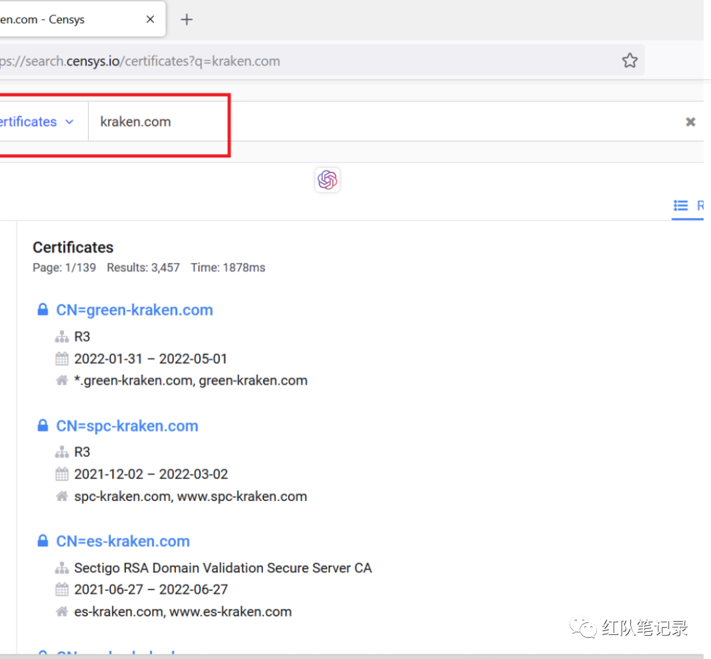
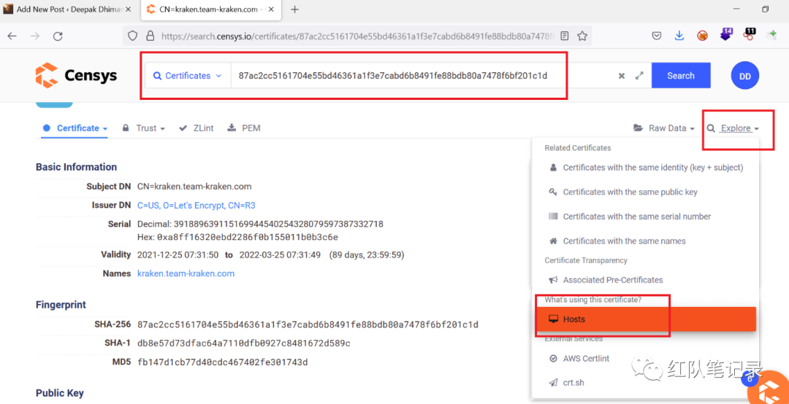
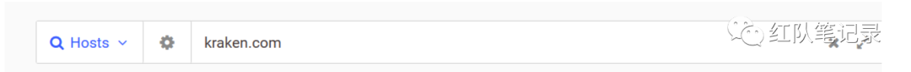
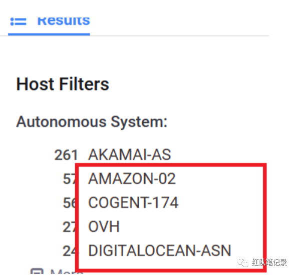

信息收集是渗透测试最重要的方面之一，可以帮助你增加攻击面，并且可以让你获取更多的漏洞。让你对目标有更深入的挖掘，

**子域名枚举**

子域名枚举是查询一个多个域查找子域名的过程

**在线查询**

```
https://Virustotal.com
https://Subdomainfinder.c99.nl
https://crt.sh/?q=%25.target.com
https://securitytrails.com/list/apex_domain/target.com
https://www.shodan.io/search?query=Ssl.cert.subject.CN%3A%22target.com%22
https://hunter.how/list?searchValue=
```

**工具查询**

```
amass
https://github.com/owasp-amass/amass

sunfinder
https://github.com/projectdiscovery/subfinder

dnsx
https://github.com/projectdiscovery/dnsx

chaos
https://chaos.projectdiscovery.io/#/

assetfinder
https://github.com/tomnomnom/assetfinder
```

**常用命令**

```
$ amass enum -passive -norecursive -noalts -df domians.txt -o subs-list.txt

$ dnsx -silent -d $domain -w ~/wordlist.txt -o ~/dnsbrute.txt

$ cat domain.txt | dnsgen - | massdns -r ~/resolvers.txt -o S -w alive.txt
```

使用 httpx 过滤子域名

```
httpx -l domain.txt -timeout 13 -o domain-probe.txt
```

**端口扫描**

```
$ naabu -list sub-list.txt -top-ports 1000 -exclude-ports 80,443,21,22,25 -o ports.txt

$ naabu -list sub-list.txt -p - -exclude-ports 80,443,21,22,25 -o ports.txt

$ cat domain-subs.txt | aquatone -ports xlarge -scan-timeout 300 -out aquatone.txt
```

**子域名爆破工具**

subbrute--子域名爆力枚举

```
https://github.com/TheRook/subbrute
```

altdns--替换域名

```
https://github.com/infosec-au/altdns
```

用法:

```
./altdns.py -i subdomains.txt -o data_output -w words.txt -r -s output.txt
```

**网站截图工具**

这些工具能够截图网站的屏幕，可以随时离线查看

工具：

```
https://github.com/RedSiege/EyeWitness
https://github.com/breenmachine/httpscreenshot
```

**枚举后收集网站**

返回网站：

```
https://github.com/tomnomnom/waybackurls
```

获取任何给定域的已知 URL

```
https://github.com/lc/gau
```

网络历史存档

```
https://web.archive.org/cdx/search/cdx?url=*.target.com&fl=original&collapse =urlkey
```

**小技巧**

收集完 url 后，curl 出 url 的 response，grep 以下 url：

drive.google

docs.google

/spreadsheets/d/

/document/d/

```
$ cat domains.txt | katana -silent | while read url; do cu=$(curl -s $url | grep -E '(drive. google | docs. google | spreadsheet\/d | document.\/d\/)' ;echo -e " ==> $url" "\n"" $cu" ; done
```

**使用 paramspider 和 gxss 来检测跨站脚本攻击（XSS）。**

命令

```
$ cat params | qsreplace yogi | dalfox pipe --mining-dom --deep-domxss --mining-dict --remotepayloads=portswigger,payloadbox --remote wordlists=burp,assetnote -o xssoutput.txt

$ cat alive.txt | waybackurls | gf xss | uro | httpx -silent | qsreplace '"><svg onload=confirm(1)>' | airixss -payload "confirm(1)" | tee xssBug3.txt
```

**使用 SQLidetector 搜索 SQL 注入攻击。**

```
https://github.com/eslam3kl/SQLiDetector
```

**shodan 搜索技巧**

```
ssl: “target[.]com” 200 http.title: “dashboard” –unauthenticated dashboard
org:“target.com” x-jenkins 200 — unauthenticated jenkins server
ssl:“target.com” 200 proftpd port:21 — proftpd port:21 org:“target.com”
http.html:zabbix — CVE-2022-24255 Main & Admin Portals: Authentication
Bypass org:“target.com” http.title:“phpmyadmin” —-php my admin
ssl:“target.com” http.title:"BIG-IP —F5 BIG-IP using CVE-2020-5902
```

**censys**

Censys: https://www.censys.io/

**使用 censys 查找真实 ip**

登录到 censys 并转到 censys 搜索页面选择证书，然后在证书中像这样搜索您的目标



现在打开任何证书，在右侧找到 Explore，将鼠标悬停在它上面并单击主机。



现在在主机中复制你找到的每个 IP 并尝试在新选项卡中打开它.

**第二种获取 ip 方法**

登录，这次将您的目标放在主机中。



现在选择其他服务系统而不是 Cloudflare 或 Akamai。



尝试新选项卡中的每个 IP 并检查自主 IP，但确保 cert.CN: 必须是 target.com 而不是其他任何东西，并且 target.com 必须在 cert.CN: 中，而不是在 http.body 或其他东西中。

grep 所有子域，使用 httpx 解析它们或在浏览器中安装多 url opener 扩展和 shodan.io 扩展。

粘贴所有 url 并尝试找出哪些克隆或看起来像 ip url（前端），如果你发现不是在该域上点击 shodan 扩展以查看它是否在 cloudflare 后面或不是这样


如果是，那么恭喜你找到了 waf 背后的 IP。

**敏感文件和目录的模糊测试**

https: //github.com/ffuf/ffuf

```
$ for i in cat host.txt; do ffuf -u $i/FUZZ -w wordlist.txt -mc 200,302,401 -se ;done
```

**查找源/备份文件**

例如

```
y0gi.hacklido.com
y0gi.hacklido.com /y0gi.zip - hacklido.zip – admin.zip – backup.zip
y0gi.hacklido.com/y0gi/y0gi.zip - hacklido.zip – admin.zip – backup.zip
y0gi.hacklido.com/hacklido/y0gi.zip - hacklido.zip – admin.zip – backup.zip
y0gi.hacklido.com/admin/y0gi.zip - hacklido.zip – admin.zip – backup.zip
```

工具

https://github.com/musana/fuzzuli

**谷歌和 GitHub 收集**

通过 Google Dork 查找云存储中的敏感数据：

```
site:http://s3.amazonaws.com “target[.]com”
site:http://blob.core.windows.net “target[.]com”
site:http://googleapis.com “target[.]com”
site:http://drive.google.com “target[.]com”
```

AWS、Jira、Okta 等的 Github 泄漏：

```
Org:“target” pwd/pass/passwd/password
“target.atlassian” pwd/pass/passwd/password
“target.okta” pwd/pass/passwd/password
“Jira.target” pwd/pass/passwd/password
```

**js 文件收集**

使用 httpx

```
httpx -content-type | grep 'application/javascript'
```

使用 nuclei 扫描

```
nuclei -t /root/nuclei-templates/exposures/
```

**小技巧**

从 Js 文件中收集所有端点并从中创建一个词表。

使用任何参数制作 POST 请求。

使用该请求对敏感目录进行模糊测试。

工具

```
Jsminer {Burp Extension}
https://github.com/KathanP19/JSFScan.sh
https://github.com/trufflesecurity/trufflehog
```

**其他的自动化框架**

```
Sudomy:
https://github.com/Screetsec/Sudomy

Reconftw：
https://github.com/six2dez/reconftw

水泽-信息收集自动化工具
https://github.com/0x727/ShuiZe_0x727
```

- http://cve.mitre.org/ - 常见漏洞和暴露。信息安全漏洞名称标准
- https://www.exploit-db.com/ - 漏洞数据库-漏洞，Shellcode 和安全文件的最终存档。
- http://0day.today/ - Inj3ct0r 是漏洞利用和漏洞的终极数据库，也是漏洞研究人员和安全专业人员的重要资源。
- http://osvdb.org/ - OSVDB 的目标是提供准确、详细、最新和公正的技术安全信息。
- http://www.securityfocus.com/ - 自 1999 年成立以来，SecurityFocus 一直是安全社区的支柱。
- http://packetstormsecurity.com/ - 全球安全资源
- https://wpvulndb.com/ - WPScan 漏洞数据库
- https://snyk.io/vuln/ - 漏洞 DB，已知漏洞的详细信息和补救指导。
