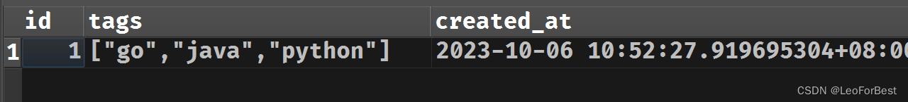
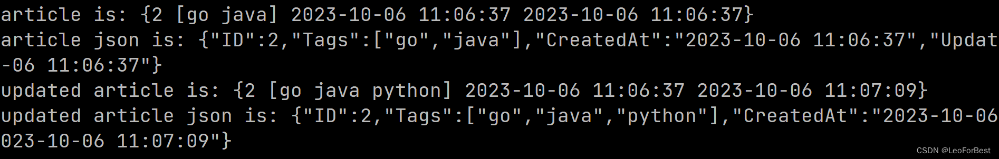

# orm 连接映射操作数据库-postgres

# gorm 自定义时间、字符串数组类型

> GORM 是 GO 语言中一款强大友好的 ORM 框架，但在使用过程中内置的数据类型不能满足以下两个需求，如下：
>
> 1. `time.Time`类型返回的是 `2023-10-03T09:12:08.53528+08:00`这种字符串格式，需要额外处理，我们更希望默认的是是`2023-10-03 09:12:08`这种可读性更高的格式
> 2. 有些数据字段需要存储数组形式，如下`Article `中`Tags`字段希望保存不确定个字符串。直接保存会提示`[error] unsupported data type: &[]`
>
> 官方提供了` Scanner` 和 `Valuer`两个接口，来满足自定义数据的存储、提取，本文记录上述两种结构解决方法。

```go
type Article struct {
	Tags  []string
}
```

### 自定义时间类型

> 自定义时间类型需满足以下两个需求:
>
> - 返回`2006-01-02 15:04:05`格式
> - `CreatedAt`和`UpdatedAt`使用时能按`GORM`规范自动填充当前时间
>
> 默认的`time.Time`是能被`gorm`自动存储，取出到结构体的，返回`2023-10-03T09:12:08.53528+08:00`格式原因是在于`json`序列化时，这里解决方案是自定义一个数据结构，添加`JSON Marshal接口`，但是自定义的数据类型`gorm`不能识别，所以要额外添加`gorm`的` Scanner` 和 `Valuer`两个接口

```go
type CustomTime time.Time

// GORM Scanner 接口, 从数据库读取到类型
func (t *CustomTime) Scan(value any) error {

	if v, ok := value.(time.Time); !ok {
		return errors.Errorf("failed to unmarshal CustomTime value: %v", value)
	} else {
		*t = CustomTime(v)
		return nil
	}
}

// GORM Valuer 接口, 保存到数据库
func (t CustomTime) Value() (driver.Value, error) {
	if time.Time(t).IsZero() {
		return nil, nil
	}
	return time.Time(t), nil
}

// JSON Marshal接口，CustomTime结构体转换为json字符串
func (t *CustomTime) MarshalJSON() ([]byte, error) {
	t2 := time.Time(*t)
	return []byte(fmt.Sprintf(`"%v"`, t2.Format("2006-01-02 15:04:05"))), nil
}
```

### 自定义字符串数组

> 代码比较简单，直接定义一个类型实现` Scanner` 和 `Valuer`两个接口，使用中将列定义为`Strings`类型即可

```go
type Strings []string

func (s *Strings) Scan(value any) error {
	v, _ := value.(string)
	return json.Unmarshal([]byte(v), s)
}
func (s Strings) Value() (driver.Value, error) {
	b, err := json.Marshal(s)
	return string(b), err
}
```

### 测试与完整代码

```go
package main

import (
	"database/sql/driver"
	"encoding/json"
	"fmt"
	"time"

	"github.com/pkg/errors"
	"github.com/glebarez/sqlite"
	"gorm.io/gorm"
)

type Strings []string

func (s *Strings) Scan(value any) error {
	v, _ := value.(string)
	return json.Unmarshal([]byte(v), s)
}
func (s Strings) Value() (driver.Value, error) {
	b, err := json.Marshal(s)
	return string(b), err
}

type CustomTime time.Time

// GORM Scanner 接口, 从数据库读取到类型
func (t *CustomTime) Scan(value any) error {

	if v, ok := value.(time.Time); !ok {
		return errors.Errorf("failed to unmarshal CustomTime value: %v", value)
	} else {
		*t = CustomTime(v)
		return nil
	}
}

// GORM Valuer 接口, 保存到数据库
func (t CustomTime) Value() (driver.Value, error) {
	if time.Time(t).IsZero() {
		return nil, nil
	}
	return time.Time(t), nil
}

// JSON Marshal接口，CustomTime结构体转换为json字符串
func (t *CustomTime) MarshalJSON() ([]byte, error) {
	t2 := time.Time(*t)
	return []byte(fmt.Sprintf(`"%v"`, t2.Format("2006-01-02 15:04:05"))), nil
}

// fmt.Printf, 【可选方法】
func (t CustomTime) String() string {
	return time.Time(t).Format("2006-01-02 15:04:05")
}

type Article struct {
	ID        uint `gorm:"primaryKey"`
	Tags      Strings
	CreatedAt CustomTime
	UpdatedAt CustomTime
}

func main() {
	db, err := gorm.Open(sqlite.Open("test.db"), &gorm.Config{})
	if err != nil {
		panic("failed to connect database")
	}

	db.AutoMigrate(&Article{})
	db.Create(&Article{Tags: []string{"go", "java"}})

	var article Article

	db.Last(&article)
	fmt.Printf("article is: %v\n", article)
	b, _ := json.Marshal(&article)
	fmt.Printf("article json is: %s\n", string(b))

	time.Sleep(time.Second * 30)
	article.Tags = append(article.Tags, "python")
	db.Save(&article)

	db.Last(&article)
	fmt.Printf("updated article is: %v\n", article)
	b, _ = json.Marshal(&article)
	fmt.Printf("updated article json is: %s\n", string(b))
}
```

#### 测试结果

> 字符串数组



> 自定义时间,可以看到满足`2006-01-02 15:04:05`格式输出，以及时间自动添加和更新
> 

```go
package abc

import (
	"context"
	"database/sql/driver"
	"encoding/json"
	"fmt"
	"reflect"
	"strconv"
	"time"

	"github.com/lib/pq"
	"github.com/olivere/elastic/v7"
	"gorm.io/gorm"
)

type DemoTest struct {
	Id        int64      `gorm:"column:id;primary_key;AUTO_INCREMENT;comment:自增编号" json:"id"`
    Number    string     `gorm:"column:number;type:varchar(255);uniqueIndex;not null;comment:C段编号" json:"number"`
	Port      MapStrings `gorm:"column:port" json:"port,omitempty"`
	Target    string     `gorm:"column:target;type:varchar(255);default:null" json:"target,omitempty"`
}

type Port struct {
	Port    int            `json:"port,omitempty"`
	Url     string         `json:"url,omitempty"`
	Title   string         `json:"title,omitempty"`
    Status  int            `json:"status,omitempty"`
	Fingers pq.StringArray `json:"fingers,omitempty"`
}

func (DemoTest) TableName() string {
	return "demo_test"
}

func (dt *DemoTest) Insert(db *gorm.DB) error {
	err := db.Create(zc)
	if err.Error != nil {
		logger.Error("Number:%v, DemoTest Insert error:%v", dt.Number, err.Error)
		return err.Error
	} else {
		logger.Success("Number:%v, DemoTest Insert Successful", dt.Number)
		return nil
	}
}

func (dt *DemoTest) Update(obj, objId string, db *gorm.DB) error {
	err := db.Where(fmt.Sprintf("%v = ?", obj), objId).Updates(dt)
	if err.Error != nil {
		logger.Error("DemoTest number:%v Update error:%v\n", dt.Number, err.Error)
		return err.Error
	} else {
		logger.Success("DemoTest number:%v Update successfully\n", dt.Number)
		return nil
	}
}

func (dt *DemoTest) Select(sobj, objId string, db *gorm.DB) (bool, int64) {
	err := db.Where(fmt.Sprintf("%v=?", sobj), objId).First(dt)
	if err.Error != nil {
		logger.Error("DemoTest Number:%v select Information error:%v", objId, err.Error)
		return false, -1
	}
	return true, dt.Id
}


func DemoMigrate(es *elastic.Client, db *gorm.DB) {
	demo, err := es.Scroll("index").TrackTotalHits(true).Scroll("10m").Do(context.Background())
	if err != nil {
		fmt.Println("scroll error:", err)
	}
	scrollid := demo.ScrollId
	for {
		if len(demo.Hits.Hits) > 0 {
			demodata := make(map[string]interface{})
			for _, item := range demo.Each(reflect.TypeOf(demodata)) {
				demotest := DemoTest{}
				mapport := []Port{}
				number, ok := item.(map[string]interface{})["number"]
				if ok {
					demotest.Number = number.(string)
					fmt.Println("aaaaaaaaaa", number)
				} else {
					continue
				}
				ip := item.(map[string]interface{})["ip"].(string)
				target := item.(map[string]interface{})["target"].(string)
				ports := item.(map[string]interface{})["port"]
				portlist := ports.([]interface{})
				for _, portinfo := range portlist {
					port := Port{}
					portmap := portinfo.(map[string]interface{})
					sport := portmap["port"]
					switch sport.(type) {
					case string:
						port.Port, _ = strconv.Atoi(fmt.Sprintf("%v", sport))
					default:
						port.Port = int(sport.(float64))
					}
					port.Url = portmap["url"].(string)
					port.Title = portmap["title"].(string)
					status := portmap["status"]
					switch status.(type) {
					case string:
						port.Status, _ = strconv.Atoi(fmt.Sprintf("%v", status))
					default:
						port.Status = int(status.(float64))
					}
					port.Server = portmap["server"].(string)
					fingers, ok := portmap["fingers"]
					if ok {
						switch fingers := fingers.(type) {
						case []interface{}:
							port.Fingers = TostringArray(fingers)
						case []string:
							port.Fingers = fingers
						default:
							port.Fingers = []string{}
						}
					}
					mapport = append(mapport, port)
				}
				demotest.Ip = ip
				demotest.Target = target
				demotest.Port = mapport
				demotest.Insert(db)
				fmt.Println(demotest)
			}
		} else {
			break
		}
		if demo.TotalHits() > int64(len(demo.Hits.Hits)) {
			demo, err = es.Scroll("index").ScrollId(scrollid).Do(context.Background())
			if err != nil {
				fmt.Println("scrollId error:", err)
			}
			scrollid = demo.ScrollId
		} else {
			break
		}
	}
}

type MapStrings []Port

func (ms *MapStrings) Scan(value any) error {
	v, _ := value.(string)
	return json.Unmarshal([]byte(v), ms)
}

func (ms MapStrings) Value() (driver.Value, error) {
	b, err := json.Marshal(ms)
	return string(b), err
}

func TostringArray(ss []interface{}) []string {
	var slicestring []string
	for _, value := range ss {
		slicestring = append(slicestring, value.(string))
	}
	return slicestring
}

```

```go
func SelectDemo(es *elastic.Client, db *gorm.DB, taskdata []map[string]string) {
	es.CloseIndex("index").Do(context.Background())
	es.OpenIndex("index").Do(context.Background())
	logger.Info("SelectDemo taskdata Len:%v", len(taskdata))
	demoData := []DemoData{}
	for _, data := range taskdata {
		number := data["Number"]
		matchquery := elastic.NewBoolQuery()
		matchquery.Must(elastic.NewMatchPhraseQuery("Number", number))
		demotest, err := es.Scroll("index").Query(matchquery).TrackTotalHits(true).Scroll("100m").Do(context.Background())
		if err != nil {
			es.CloseIndex("index").Do(context.Background())
			es.OpenIndex("index").Do(context.Background())
			logger.Error("Number:%v select demotest es Scroll error:%v", number, err)
		}
		scrollid := demotest.ScrollId
		for {
			if len(demotest.Hits.Hits) > 0 {
				demodatas := make(map[string]interface{})
				for _, item := range demotest.Each(reflect.TypeOf(demodatas)) {
					demodata := DemoData{}
					number := item.(map[string]interface{})["number"]
					name := item.(map[string]interface{})["name"]
					title := item.(map[string]interface{})["title"]
					port := item.(map[string]interface{})["port"]
					alive := item.(map[string]interface{})["alive"]
					createTime := item.(map[string]interface{})["createTime"]
					lastTime := item.(map[string]interface{})["lastTime"]
					createtime, _ := time.ParseInLocation("2006-01-02T15:04:05", createTime.(string), time.Local)
					lasttime, _ := time.ParseInLocation("2006-01-02T15:04:05", lastTime.(string), time.Local)
					fingerprint := item.(map[string]interface{})["fingerprint"]
					waf := item.(map[string]interface{})["waf"]
					demodata.Number = number.(string)
					demodata.Name = name.(string)
					demodata.Tile = title.(string)
					switch port.(type) {
					case string:
						demodata.Port, _ = strconv.Atoi(fmt.Sprintf("%v", port))
					default:
						demodata.Port = int(port.(float64))
					}
					if alive != "" {
						demodata.Alive = int(alive.(float64))
					}
					demodata.CreatedAt = createtime
					demodata.UpdatedAt = lasttime
					if fingerprint != "" {
						switch fingerprint := fingerprint.(type) {
						case string:
							demodata.Fingerprint = []string{fingerprint}
						default:
							demodata.Fingerprint = TostringArray(fingerprint.([]interface{}))
						}
					}
					if waf != "" {
						switch waf := waf.(type) {
						case string:
							demodata.Waf = []string{waf}
						default:
							demodata.Waf = utils.TostringArray(waf.([]interface{}))
						}
					}
					// demodata.Insert(db)
					fmt.Println("demoData Data Info:", demodata)
					demoData = append(demoData, demodata)
				}
			} else {
				break
			}
			if demotest.TotalHits() > int64(len(demotest.Hits.Hits)) {
				demotest, err = es.Scroll("index").ScrollId(scrollid).Do(context.Background())
				if err != nil {
					logger.Error("demoData es Scroll ScrollId error:%v", err)
				}
				scrollid = demotest.ScrollId
			} else {
				break
			}
		}
		es.ClearScroll(scrollid)
		es.CloseIndex("index").Do(context.Background())
		es.OpenIndex("index").Do(context.Background())
	}
	fmt.Println("DemoTest Len", len(demoData))
}
```
