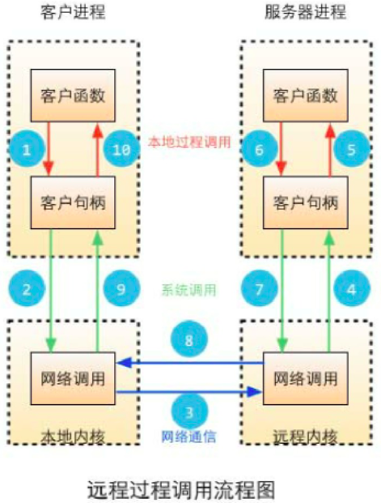

一、什么是 RPC

远程过程调用（Remote Procedure Call，缩写为 RPC）是一个计算机通信协议。该协议允许运行于一台计算机的程序调用另一台计算机的子程序，而程序员无需额外地为这个交互作用编程。如果涉及的软件采用面向对象编程，那么远程过程调用亦可称作远程调用或远程方法调用。

用通俗易懂的语言描述就是：RPC 允许跨机器、跨语言调用计算机程序方法。打个比方，我用 go 语言写了个获取用户信息的方法 getUserInfo，并把 go 程序部署在阿里云服务器上面，现在我有一个部署在腾讯云上面的 php 项目，需要调用 golang 的 getUserInfo 方法获取用户信息，php 跨机器调用 go 方法的过程就是 RPC 调用。

二、RPC 工作流程：

三、go 支持三个级别的 RPC( HTTP，TCP，JSONRPC)

四、实现 RPC 实例：

3.1 GO RPC 的函数只有符合以下条件才能被远程访问:

    函数必须是首字母是大写
    必须有两个首字母大写的参数
    第一个参数是接收的参数，第二个参数是返回给客户端的参数，第二个参数必须是指针类型的
    函数还要有一个返回值error
    func (t *T)MethodName(arg1 T1, returnArg *T2)error

3.2 golang 中如何实现 RPC

在 golang 中实现 RPC 非常简单，有封装好的官方库和一些第三方库提供支持。Go RPC 可以利用 tcp 或 http 来传递数据，可以对要传递的数据使用多种类型的编解码方式。golang 官方的 net/rpc 库使用 encoding/gob 进行编解码，支持 tcp 或 http 数据传输方式，由于其他语言不支持 gob 编解码方式，所以使用 net/rpc 库实现的 RPC 方法没办法进行跨语言调用。

golang 官方还提供了 net/rpc/jsonrpc 库实现 RPC 方法，JSON RPC 采用 JSON 进行数据编解码，因而支持跨语言调用。但目前的 jsonrpc 库是基于 tcp 协议实现的，暂时不支持使用 http 进行数据传输。

除了 golang 官方提供的 rpc 库，还有许多第三方库为在 golang 中实现 RPC 提供支持，大部分第三方 rpc 库的实现都是使用 protobuf 进行数据编解码，根据 protobuf 声明文件自动生成 rpc 方法定义与服务注册代码，在 golang 中可以很方便的进行 rpc 服务调用。
