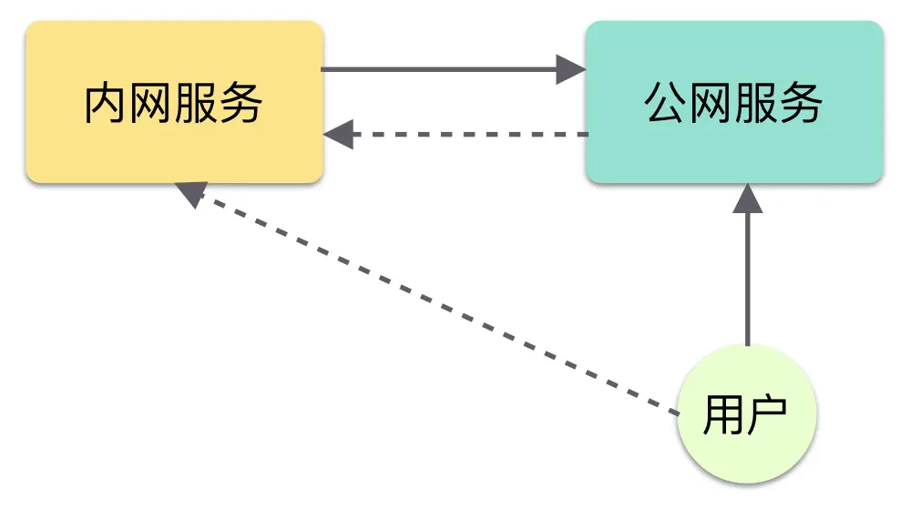
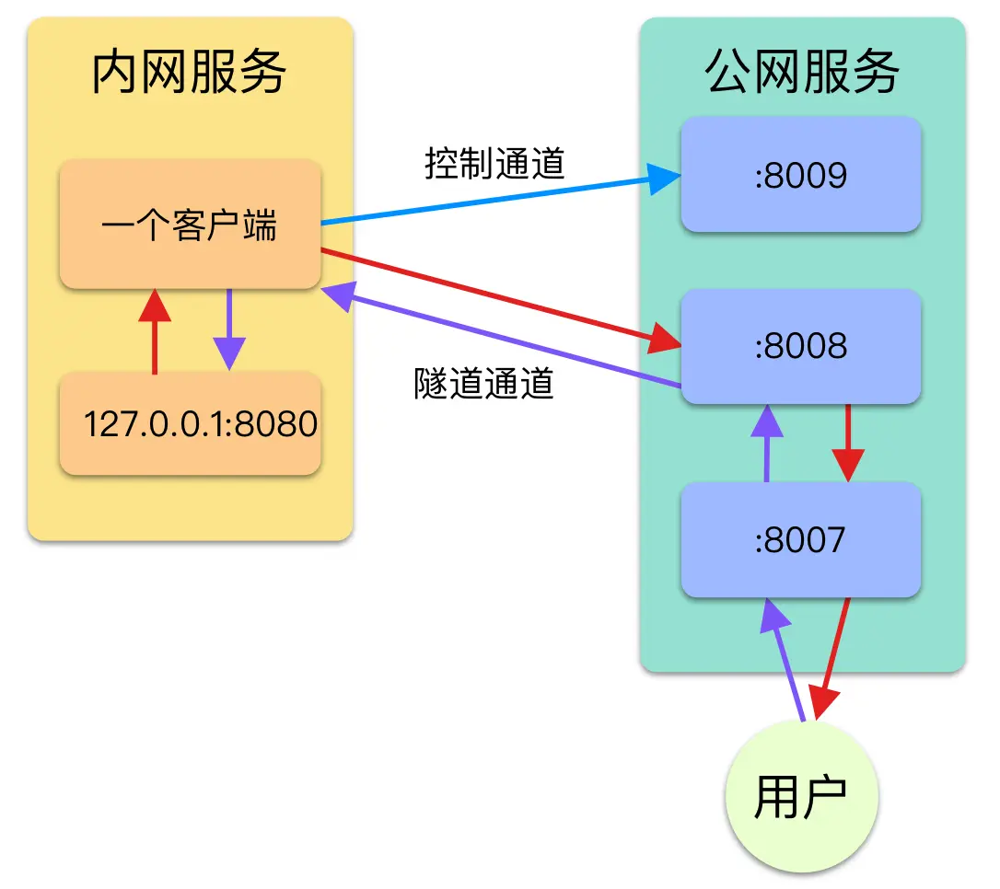

# 代码实现内网穿透

## 原因分析

我们经常会遇到一个问题，如何将本机的服务暴露到公网上，让别人也可以访问。我们知道，在家上网的时候我们有一个 IP 地址，但是这个 IP 地址并不是一个公网的 IP 地址，别人无法通过一个 IP 地址访问到你的服务，所以在例如：微信接口调试、三方对接的时候，你必须将你的服务部署到一个公网的系统中去，这样太累了。

这个时候，内网穿透就出现了，它的作用就是即使你在家的服务，也能被其人访问到。

今天让我们来用一个最简单的案例学习一下如何用 go 来做一个最简单的内网穿透工具。

## 整体结构

首先我们用几张图来说明一下我们是如何实现的，说清楚之后再来用代码实现一下。

### 当前网络情况



当前网络情况

我们可以看到，画实线的是我们当前可以访问的，画虚线的是我们当前无法进行直接访问的。

我们现在有的路是：

1. 用户主动访问公网服务器是可以的
2. 内网主动访问公网服务也是可以的

当前我们要做的是想办法能让用户访问到内网服务，所以如果能做到公网服务访问到内网服务，那么用户就能间接访问到内网服务了。

想是这么想的，但是实际怎么做呢？用户访问不到内网服务，那我公网服务器同样访问不到吧。所以我们就需要利用现有的链路来完成这件事。

### 基本架构



image-20200408232311358

- 内网，客户端（我们要搞一个）
- 外网，服务端（我们也要搞一个）
- 访问者，用户

1. 首先我们需要一个控制通道来传递消息，因为只有内网可以访问公网，公网不知道内网在哪里，所以第一次肯定需要客户端主动告诉服务端我在哪
2. 服务端通过 8007 端口监听用户来的请求
3. 当用户发来请求时，服务端需要通过控制信道告诉客户端，有用户来了
4. 客户端收到消息之后建立隧道通道，主动访问服务端的 8008 来建立 TCP 连接
5. 此时客户端需要同时与本地需要暴露的服务 127.0.0.1:8080 建立连接
6. 连接完成后，服务端需要将 8007 的请求转发到隧道端口 8008 中
7. 客户端从隧道中获得用户请求，转发给内网服务，同时将内网服务的返回信息放入隧道

最终请求流向是，如图中的紫色箭头走向，请求返回是如图中红色箭头走向。

需要理解的是，TCP 一旦建立了连接，双方就都可以向对方发送信息了，所以其实原理很简单，就是利用已有的单向路建立 TCP 连接，从而知道对方的位置信息，然后将请求进行转发即可。

## 代码实现

### 工具方法

首先我们先定义三个需要使用的工具方法，还需要定义两个消息编码常量，后面会用到

1. 监听一个地址对应的 TCP 请求 `CreateTCPListener`
2. 连接一个 TCP 地址 `CreateTCPConn`
3. 将一个 TCP-A 连接的数据写入另一个 TCP-B 连接，将 TCP-B 连接返回的数据写入 TCP-A 的连接中 `Join2Conn` （别看这短短 10 几行代码，这就是核心了）

```go
/*
@File   : network.go
@Author : pan
@Time   : 2024-08-01 11:50:52
*/
package network

import (
	"io"
	"log"
	"net"
)

const (
	KeepAlive     = "KEEP_ALIVE"
	NewConnection = "NEW_CONNECTION"
)

func CreateTCPListener(addr string) (*net.TCPListener, error) {
	tcpAddr, err := net.ResolveTCPAddr("tcp", addr)
	if err != nil {
		return nil, err
	}
	tcpListener, err := net.ListenTCP("tcp", tcpAddr)
	if err != nil {
		return nil, err
	}
	return tcpListener, nil
}

func CreateTCPConn(addr string) (*net.TCPConn, error) {
	tcpAddr, err := net.ResolveTCPAddr("tcp", addr)
	if err != nil {
		return nil, err
	}
	tcpListener, err := net.DialTCP("tcp", nil, tcpAddr)
	if err != nil {
		return nil, err
	}
	return tcpListener, nil
}

func Join2Conn(local *net.TCPConn, remote *net.TCPConn) {
	go joinConn(local, remote)
	go joinConn(remote, local)
}

func joinConn(local *net.TCPConn, remote *net.TCPConn) {
	defer local.Close()
	defer remote.Close()
	_, err := io.Copy(local, remote)
	if err != nil {
		log.Println("copy failed ", err.Error())
		return
	}
}

```

### 客户端

我们先来实现相对简单的客户端，客户端主要做的事情是 3 件：

1. 连接服务端的控制通道
2. 等待服务端从控制通道中发来建立连接的消息
3. 收到建立连接的消息时，将本地服务和远端隧道建立连接（这里就要用到我们的工具方法了）

```go
/*
@File   : main.go
@Author : pan
@Time   : 2024-08-01 11:50:38
*/
package main

import (
	"bufio"
	"io"
	"log"
	"net"

	"function/tunnel/network"
)

var (
	// 本地需要暴露的服务端口
	localServerAddr = "127.0.0.1:32768"

	remoteIP = "111.111.111.111"
	// 远端的服务控制通道，用来传递控制信息，如出现新连接和心跳
	remoteControlAddr = remoteIP + ":8009"
	// 远端服务端口，用来建立隧道
	remoteServerAddr = remoteIP + ":8008"
)

func main() {
	tcpConn, err := network.CreateTCPConn(remoteControlAddr)
	if err != nil {
		log.Println("[连接失败]" + remoteControlAddr + err.Error())
		return
	}
	log.Println("[已连接]" + remoteControlAddr)

	reader := bufio.NewReader(tcpConn)
	for {
		s, err := reader.ReadString('\n')
		if err != nil || err == io.EOF {
			break
		}

		// 当有新连接信号出现时，新建一个tcp连接
		if s == network.NewConnection+"\n" {
			go connectLocalAndRemote()
		}
	}

	log.Println("[已断开]" + remoteControlAddr)
}

func connectLocalAndRemote() {
	local := connectLocal()
	remote := connectRemote()

	if local != nil && remote != nil {
		network.Join2Conn(local, remote)
	} else {
		if local != nil {
			_ = local.Close()
		}
		if remote != nil {
			_ = remote.Close()
		}
	}
}

func connectLocal() *net.TCPConn {
	conn, err := network.CreateTCPConn(localServerAddr)
	if err != nil {
		log.Println("[连接本地服务失败]" + err.Error())
	}
	return conn
}

func connectRemote() *net.TCPConn {
	conn, err := network.CreateTCPConn(remoteServerAddr)
	if err != nil {
		log.Println("[连接远端服务失败]" + err.Error())
	}
	return conn
}

```

### 服务端

服务端的实现就相对复杂一些了：

1. 监听控制通道，接收客户端的连接请求
2. 监听访问端口，接收来自用户的 http 请求
3. 第二步接收到请求之后需要存放一下这个连接并同时发消息给客户端，告诉客户端有用户访问了，赶紧建立隧道进行通信
4. 监听隧道通道，接收来自客户端的连接请求，将客户端的连接与用户的连接建立起来（也是用工具方法）

```go
/*
@File   : main.go
@Author : pan
@Time   : 2024-08-01 11:50:38
*/
package main

import (
	"log"
	"net"
	"strconv"
	"sync"
	"time"

	"function/tunnel/network"
)

const (
	controlAddr = "0.0.0.0:8009"
	tunnelAddr  = "0.0.0.0:8008"
	visitAddr   = "0.0.0.0:8007"
)

var (
	clientConn         *net.TCPConn
	connectionPool     map[string]*ConnMatch
	connectionPoolLock sync.Mutex
)

type ConnMatch struct {
	addTime time.Time
	accept  *net.TCPConn
}

func main() {
	connectionPool = make(map[string]*ConnMatch, 32)
	go createControlChannel()
	go acceptUserRequest()
	go acceptClientRequest()
	cleanConnectionPool()
}

// 创建一个控制通道，用于传递控制消息，如：心跳，创建新连接
func createControlChannel() {
	tcpListener, err := network.CreateTCPListener(controlAddr)
	if err != nil {
		panic(err)
	}

	log.Println("[已监听]" + controlAddr)
	for {
		tcpConn, err := tcpListener.AcceptTCP()
		if err != nil {
			log.Println(err)
			continue
		}

		log.Println("[新连接]" + tcpConn.RemoteAddr().String())
		// 如果当前已经有一个客户端存在，则丢弃这个链接
		if clientConn != nil {
			_ = tcpConn.Close()
		} else {
			clientConn = tcpConn
			go keepAlive()
		}
	}
}

// 和客户端保持一个心跳链接
func keepAlive() {
	go func() {
		for {
			if clientConn == nil {
				return
			}
			_, err := clientConn.Write(([]byte)(network.KeepAlive + "\n"))
			if err != nil {
				log.Println("[已断开客户端连接]", clientConn.RemoteAddr())
				clientConn = nil
				return
			}
			time.Sleep(time.Second * 3)
		}
	}()
}

// 监听来自用户的请求
func acceptUserRequest() {
	tcpListener, err := network.CreateTCPListener(visitAddr)
	if err != nil {
		panic(err)
	}
	defer tcpListener.Close()
	for {
		tcpConn, err := tcpListener.AcceptTCP()
		if err != nil {
			continue
		}
		addConn2Pool(tcpConn)
		sendMessage(network.NewConnection + "\n")
	}
}

// 将用户来的连接放入连接池中
func addConn2Pool(accept *net.TCPConn) {
	connectionPoolLock.Lock()
	defer connectionPoolLock.Unlock()

	now := time.Now()
	connectionPool[strconv.FormatInt(now.UnixNano(), 10)] = &ConnMatch{now, accept}
}

// 发送给客户端新消息
func sendMessage(message string) {
	if clientConn == nil {
		log.Println("[无已连接的客户端]")
		return
	}
	_, err := clientConn.Write([]byte(message))
	if err != nil {
		log.Println("[发送消息异常]: message: ", message)
	}
}

// 接收客户端来的请求并建立隧道
func acceptClientRequest() {
	tcpListener, err := network.CreateTCPListener(tunnelAddr)
	if err != nil {
		panic(err)
	}
	defer tcpListener.Close()

	for {
		tcpConn, err := tcpListener.AcceptTCP()
		if err != nil {
			continue
		}
		go establishTunnel(tcpConn)
	}
}

func establishTunnel(tunnel *net.TCPConn) {
	connectionPoolLock.Lock()
	defer connectionPoolLock.Unlock()

	for key, connMatch := range connectionPool {
		if connMatch.accept != nil {
			go network.Join2Conn(connMatch.accept, tunnel)
			delete(connectionPool, key)
			return
		}
	}

	_ = tunnel.Close()
}

func cleanConnectionPool() {
	for {
		connectionPoolLock.Lock()
		for key, connMatch := range connectionPool {
			if time.Since(connMatch.addTime) > time.Second*10 {
				_ = connMatch.accept.Close()
				delete(connectionPool, key)
			}
		}
		connectionPoolLock.Unlock()
		time.Sleep(5 * time.Second)
	}
}
```

### 其他

- 其中我加入了 keepalive 的消息，用于保持客户端与服务端的一直正常连接
- 我们还需要定期清理一下服务端 map 中没有建立成功的连接

## 实验一下

首先在本机用 dokcer 部署一个 nginx 服务（你可以启动一个 tomcat 都可以的），并修改客户监听端口localServerAddr为127.0.0.1:32768，并修改remoteIP 为服务端 IP 地址。然后访问以下，看到是可以正常访问的。


然后编译打包服务端扔到服务器上启动、客户端本地启动，如果控制台输出连接成功，就完成准备了

现在通过访问服务端的 8007 端口就可以访问我们内网的服务了。


## 遗留问题

上述的实现是一个最小的实现，也只是为了完成基本功能，还有一些遗留的问题等待你的处理：

- 现在一个客户端连接上了就不能连接第二个了，那怎么做多个客户端的连接呢？
- 当前这个 map 的使用其实是有风险的，如何做好连接池的管理？
- TCP 连接的开销是很大的，如何做好连接的复用？
- 当前是 TCP 的连接，那么如果是 UDP 如何实现呢？
- 当前连接都是不加密的，如何进行加密呢？
- 当前的 keepalive 实现很简单，有没有更优雅的实现方式呢？

这些就交给聪明的你来完成了

## 总结

其实最后回头看看实现起来并不复杂，用 go 来实现已经是非常简单了，所以 github 上面有很多利用 go 来实现代理或者穿透的工具，我也是参考它们抽离了其中的核心，最重要的就是工具方法中的第三个 copy 了，不过其实还有很多细节点需要考虑的。你可以参考下面的源码继续深入探索一下。

[https://github.com/fatedier/frp](https://links.jianshu.com/go?to=https%3A%2F%2Fgithub.com%2Ffatedier%2Ffrp)

[https://github.com/snail007/goproxy](https://links.jianshu.com/go?to=https%3A%2F%2Fgithub.com%2Fsnail007%2Fgoproxy)