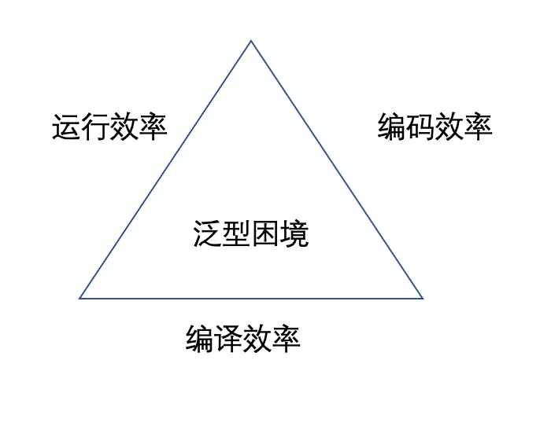
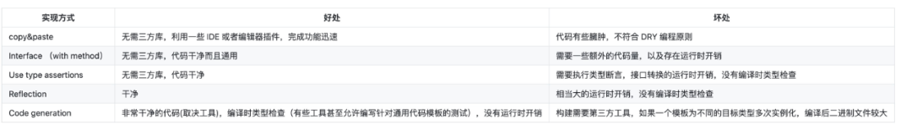
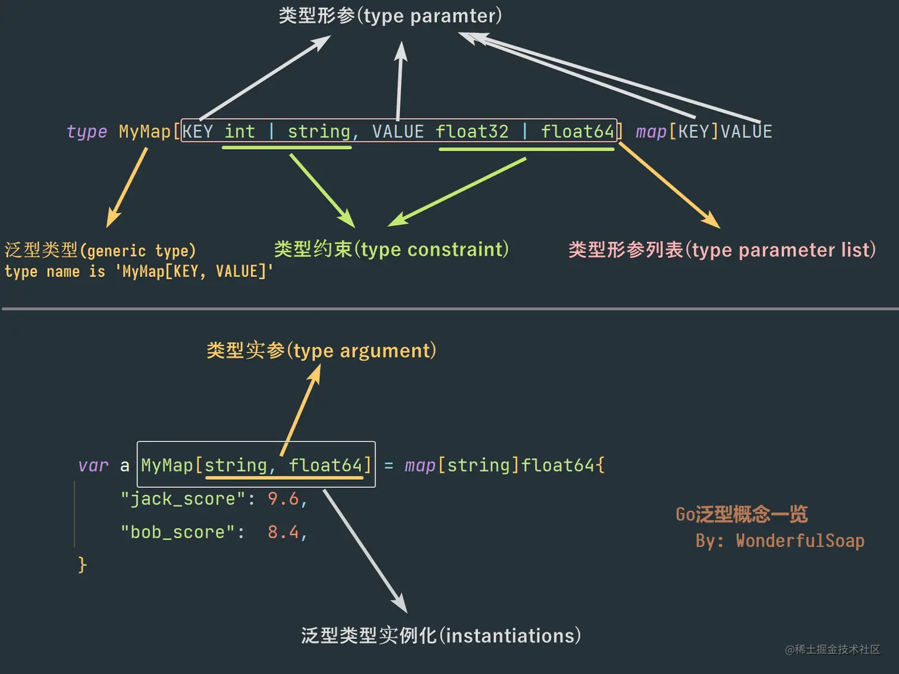

# Go 泛型 comparable

## **关于 Go 泛型的开发进度**

Go 是一门强类型语言，意味着程序中的每个变量和值都有某种特定的类型，例如 int、string 等。没有泛型，很多人以此“鄙视”Golang。当然，也有人觉得根本不需要泛型。有泛型，不代表你一定要用。在复用代码等场景下，泛型还是很有必要和帮助的。比如：

```go
func Add(a, b int) int
func AddFloat(a, b float64) float64
```

在泛型的帮助下，上面代码就可以简化成为：

```go
func Add[T any](a, b T) T
```

- Add 后面的[T any]，T 表示类型的标识，any 表示 T 可以是任意类型。
- a、b 和返回值的类型 T 和前面的 T 是同一个类型。
- 为什么用[]，而不是其他语言中的<>，官方有过解释，大概就是<>会有歧义。曾经计划使用() ，因为太容易混淆，最后使用了[]。

**一、泛型**

### **（一）什么是泛型**

谈泛型的概念，可以从多态看起，多态是同一形式表现出不同行为的一种特性，在编程语言中被分为两类，临时性多态和参数化多态。

**临时性多态**（Ad hoc Polymorphism），根据实参类型调用相应的版本，仅支持数量十分有限的调用，也被称作特设多态，例如函数重载。

```go
func Add(a, b int) int { return a+b }
func Add(a, b float64) float64 { return a+b } // 注意: Golang中不允许同名函数
Add(1, 2)     // 调用第一个
Add(1.0, 2.0) // 调用第二个
Add(“1”, “2”) // 编译时不检查，运行时找不到实现，崩溃或者编译时直接不通过
```

**参数化多态**（Parametric Polymorphism），根据实参生成不同的版本，支持任意数量的调用，即泛型，简言之，就是把元素类型变成了参数。

```go
func Add(a, b T)  T {  return a+b  }
Add(1, 2)              // 编译器生成 T = int 的 Add
Add(float64(1.0), 2.0) // 编译器生成 T = float64 的 Add
Add("1", "2")          // 编译器生成 T = string 的 Add
```

### **（二）泛型困境**

泛型和其他特性一样不是只有好处，为编程语言加入泛型会遇到需要权衡的两难问题。语言的设计者需要在编程效率、编译速度和运行速度三者进行权衡和选择，编程语言要选择牺牲一个而保留另外两个。

在 2009 年的时候，Russ Cox 提出来的一个关于泛型的问题叫做泛型困境，用来收集人们对 Golang 中泛型的一些意见和建议，对 Golang 泛型设计当中的问题进行解释，并表示他们并不急于去实现泛型，因为还没有找到一个合适的实现方案去解决困境。

而泛型困境的本质是，关于泛型，你想要缓慢的程序员、缓慢的编译器和臃肿的二进制文件，还是缓慢的执行时间。简单来说就是：要么苦了程序员，要么苦了编绎器，要么降低运行时效率。



以 C、C++和 Java 为例，它们在泛型的设计上有着不同考量：

- C 语言是系统级的编程语言，没有支持泛型，本身提供的抽象能力非常有限。结果是牺牲了程序员的开发效率，与 Golang 目前的做法一样，它们都需要手动实现不同类型的相同逻辑。但是不引入泛型的好处也显而易见，那就是降低了编译器实现的复杂度，也能保证源代码的编译速度；

- C++与 C 语言的选择完全不同，它使用编译期间类型特化实现泛型，提供了非常强大的抽象能力。虽然提高了程序员的开发效率，不再需要手写同一逻辑的相似实现，但是编译器的实现变得非常复杂，泛型展开会生成的大量重复代码也会导致最终的二进制文件膨胀和编译缓慢，我们往往需要链接器来解决代码重复的问题；

- Java 在 1.5 版本引入了泛型，它的泛型是用类型擦除实现的。Java 的泛型只是在编译期间用于检查类型的正确，为了保证与旧版本 JVM 的兼容，类型擦除会删除泛型的相关信息，导致其在运行时不可用。编译器会插入额外的类型转换指令，与 C 语言和 C++在运行前就已经实现或者生成代码相比，Java 类型的装箱和拆箱会降低程序的执行效率

而 C、C++和 Java 相比，Golang 旨在作为一种编写服务器程序的语言，这些程序随着时间的推移易于维护，侧重于可伸缩性、可读性和并发性等多种方面。泛型编程在当时似乎对 Golang 的目标并不重要，因此为了简单起见被排除在外。

### **（三）实现泛型的方式**



例如下面是一位程序猿自己写的一个实现类似泛型的代码：


**二、Golang 中的泛型**

## **（一）关于 Go 泛型的开发进度**

Go 是一门强类型语言，意味着程序中的每个变量和值都有某种特定的类型，例如 int、string 等。没有泛型，很多人以此“鄙视”Golang。当然，也有人觉得根本不需要泛型。有泛型，不代表你一定要用。在复用代码等场景下，泛型还是很有必要和帮助的。比如：

```swift
func Add(a, b int) int
func AddFloat(a, b float64) float64
```

在泛型的帮助下，上面代码就可以简化成为：

```markdown
func Add[T any](a, b T) T
```

- Add 后面的[T any]，T 表示类型的标识，any 表示 T 可以是任意类型。

- a、b 和返回值的类型 T 和前面的 T 是同一个类型。

- 为什么用[]，而不是其他语言中的<>，官方有过解释，大概就是<>会有歧义。曾经计划使用() ，因为太容易混淆，最后使用了[]。

Golang 团队一直在尝试泛型的设计，之前也有很多的努力和尝试，包括各种泛型提案和实现方式，但最后都被否决了。Golang 核心作者给出的解释是泛型并不是不可或缺的特性，属于重要但不紧急，应该把精力集中在更重要的事情上，例如 GC 的延迟优化，编译器自举等。现在他们认为 Goalng 现在更加成熟了，加上目前泛型是 Golang 社区呼声最高的，希望被尽快实现的语言特性，因此，可以考虑某种形式的泛型编程。

目前，在 1.17 的版本中 Golang 终于推出来泛型的尝鲜版了，官方目前预计此更改将在 2022 年初的 Go1.18 版本中可用（We currently expect that this change will be available in the Go1.18 release in early 2022.）。而泛型，是 Golang 多年来最令人兴奋和根本性的变化之一。

### **（二）Golang1.17 中泛型的要点**

- 函数可以通过 type 关键字引入额外的类型参数(type parameters)列表：func F(type T)(p T) { ... } 。

- 这些类型参数可以像一般的参数一样在函数体中使用。

- 类型也可以拥有类型参数列表：type M(type T) []T。

- 每个类型参数可以拥有一个约束：func F(type T Constraint)(p T) { ... }。

- 使用 interface 来描述类型的约束。

- 被用作类型约束的 interface 可以拥有一个预声明类型列表，限制了实现此接口的类型的基础类型。

- 使用泛型函数或类型时需要传入类型实参。

- 一般情况下，类型推断允许用户在调用泛型函数时省略类型实参。

- 如果类型参数具有类型约束，则类型实参必须实现接口。

- 泛型函数只允许进行类型约束所规定的操作。

###

### **（三）如何使用**

- 可以直接在https://go2goplay.golang.org/进行测试使用。

- 在 docker 中装个 1.17 的版本，运行时用 go run-gcflags=-G=3~/main.go 命令就好了。

**三、Golang 泛型案例**

### **（一）如何对泛型进行输出**

下面的例子是一个对泛型输出的基本例子。函数可以有一个额外的类型参数列表，它使用方括号，但看起来像一个普通的参数列表：func F[T any](p T) { ... }，代码中的[T any]即为类型参数，意思是该函数支持任何 T 类型，当我们调用 printSlice[string]([]string{“Hello”，“World”})时，会被类型推导为 string 类型，不过在编译器完全可以实现类型推导时，也可以省略显式类型，如：printSlice([]string{“Hello”，“World”}) ，这样也将会是对的；

```go
package main

import (
    "fmt"
)

func printSlice[T any](s []T) {
    for _, v := range s {
        fmt.Printf("%v ", v)
    }
    fmt.Print("\n")
}

func main() {
    printSlice[int]([]int{1, 2, 3, 4, 5})
    printSlice[float64]([]float64{1.01, 2.02, 3.03, 4.04, 5.05})
    printSlice([]string{"Hello", "World"})
    printSlice[int64]([]int64{5, 4, 3, 2, 1})
}

输出为：
1 2 3 4 5
1.01 2.02 3.03 4.04 5.05
Hello World
5 4 3 2 1
```

### **（二）如何用泛型约束使用的类型范围**

这个例子包含了一个**类型约束**。每个类型参数都有一个类型约束，就像每个普通参数都有一个类型：func F[T Constraint](p T) { ... }，类型约束是接口类型。该提案扩展了 interface 语法，新增了类型列表(type list)表达方式，专用于对类型参数进行约束。

```go
package main

import (
    "fmt"
)

type Addable interface {
    type int, int8, int16, int32, int64,
    uint, uint8, uint16, uint32, uint64, uintptr,
    float32, float64, complex64, complex128,
    string
}

func add[T Addable] (a, b T) T {
    return a + b
}

func main() {
    fmt.Println(add(1,2))
    fmt.Println(add("hello","world"))
}

输出为：
3
helloworld
```

在官方的最新 proposal 里有提到，在 Golang 中，并不是所有的类型都满足+号运算。在 1.17 的版本中，泛型函数只能使用类型参数所能实例化出的任意类型都能支持的操作。

比如下面的 add 函数的类型参数 T 没有任何约束，它可以被实例化为任何类型；那么这些实例化后的类型是否都支持+操作符运算呢？显然不是；因此，报错了！对于没有任何约束的类型参数实例，允许对其进行的操作包括：

- 声明这些类型的变量。
- 使用相同类型的值为这些变量赋值。
- 将这些类型的变量以实参形式传给函数或从作为函数返回值。
- 取这些变量的地址。
- 将这些类型的值转换或赋值给 interface{}类型变量。
- 通过类型断言将一个接口值赋值给这类类型的变量。
- 在 type switch 块中作为一个 case 分支。
- 定义和使用由该类型组成的复合类型，比如：元素类型为该类型的切片。
- 将该类型传递给一些内置函数，比如 new。

这就意味着，如果不用 interface 约束，直接使用的话，你讲得到如下的结果：

```go
package main

import (
    "fmt"
)

func add[T any] (a, b T) T {
    return a + b
}

func main() {
    fmt.Println(add(1,2))
    fmt.Println(add("hello","world"))
}

输出：
type checking failed for main
prog.go2:8:9: invalid operation: operator + not defined for a (variable of type parameter type T)
```

在约束里，甚至可以放进去接口如下：

```go
package main

import (
    "fmt"
)

type Addable interface {
    type int,interface{}
}


func add[T Addable] (a T) T {
    return a
}

func main() {
    fmt.Println(add(1))
}
```

接着假如我们去掉 string，如下代码所示。以该示例为例，如果编译器通过类型推导得到的类型不在这个接口定义的类型约束列表中，那么编译器将允许这个类型参数实例化；否则就像类型参数实例化将报错！

```go
package main

import (
    "fmt"
)

type Addable interface {
    type int, int8, int16, int32, int64,
    uint, uint8, uint16, uint32, uint64, uintptr,
    float32, float64, complex64, complex128
}


func add[T Addable] (a, b T) T {
    return a + b
}

func main() {
    fmt.Println(add(1,2))
    fmt.Println(add("hello","world"))
}

输出为：
type checking failed for main
prog.go2:19:14: string does not satisfy Addable (string or string not found in int, int8, int16, int32, int64, uint, uint8, uint16, uint32, uint64, uintptr, float32, float64, complex64, complex128)
```

**注意**：我们自己定义的带有类型列表的接口将无法用作接口变量类型，如下代码将会报错

```go
package main

type MyType interface {
    type int
}

func main() {
    var n int = 6
    var i MyType
    i = n
    _ = i
}

输出为：
type checking failed for main
prog.go2:9:8: interface contains type constraints (int)
```

### **（三）泛型中的接口本身对范型进行约束**

```go
package main

import (
  "fmt"
  "strconv"
)

type MyStringer interface {
    String() string
}

type StringInt int

type myString string

func (i StringInt) String() string {
    return strconv.Itoa(int(i))
}

func (str myString) String() string {
    return string(str)
}

func stringify[T MyStringer](s []T) (ret []string) {
    for _, v := range s {
        ret = append(ret, v.String())
    }
    return ret
}

func stringify2[T MyStringer](s []T) (ret []string) {
    for _, v := range s {
        ret = append(ret, v.String())
    }
    return ret
}

func main() {
    fmt.Println(stringify([]StringInt{1, 2, 3, 4, 5}))
    fmt.Println(stringify2([]myString{"1", "2", "3", "4", "5"}))
}

输出为：
[1 2 3 4 5]
[1 2 3 4 5]
```

代码中我们声明了 MyStringer 接口，并且使用 StringInt 和 myString 类型实现了此接口；在范型方法中，我们声明了范型的类型为：任意实现了 MyStringer 接口的类型；只要实现了这个接口，那么你就可以直接使用，在现在某些需要传 interface{}作为参数的函数里面，可以直接指定类型了。当你改为如下代码时

```go
func main() {
    fmt.Println(Stringify([]int{1, 2, 3, 4, 5}))
}
```

会报错：

```cpp
输出为：
type checking failed for main
prog.go2:27:14: int does not satisfy MyStringer (missing method String)
```

只有实现了 Stringer 接口的类型才会被允许作为实参传递给 Stringify 泛型函数的类型参数并成功实例化！当然也可以将 MyStringer 接口写成如下的形式：

```go
type MySignedStringer interface {
    type int, int8, int16, int32, int64
    String() string
}
```

表示只有 int, int8, int16, int32, int64，这样类型参数的实参类型既要在 MySignedStringer 的类型列表中，也要实现了 MySignedStringer 的 String 方法，才能使用。像这种不在里面的 type StringInt uint 就会报错。

### **（四）泛型中如何操作切片**

可以看到在下面的例子里面，我们声明了一个可以存放任何类型的切片，叫做 slice，如 type slice[T any] []T。和泛型函数一样，使用泛型类型时，首先要对其进行实例化，即显式为**类型参数**赋值类型。如果在类型定义时，将代码改成 vs:=slice{5,4,2,1}，那么你会得到如 note1 中的结果。因为编译器并没有办法进行类型推导，也就是表示它并不知道，你输出的是那种类型。哪怕你在 interface 里面定义了约束。哪怕你在接口中定义了类型约束 type int, string，同样会报错，如 note2 所示。

```go
package main

import (
    "fmt"
)

type slice[T any] []T

/*
type any interface {
  type int, string
}*/

func printSlice[T any](s []T) {
    for _, v := range s {
        fmt.Printf("%v ", v)
    }
    fmt.Print("\n")
}

func main() {
    // note1: cannot use generic type slice[T interface{}] without instantiation
    // note2: cannot use generic type slice[T any] without instantiation
    vs := slice[int]{5, 4, 2, 1}
    printSlice(vs)
    vs2 := slice[string]{"hello", "world"}
    printSlice(vs2)
}

输出为：
5 4 2 1
hello world
```

### **（五）如何利用泛型实现最大值最小值函数**

```go
package main

import (
    "fmt"
)

type minmax interface {
    type int, int8, int16, int32, int64, uint, uint8, uint16, uint32, uint64, uintptr, float32, float64
}

func max[T minmax](a []T) T {
    m := a[0]
    for _, v := range a {
        if m < v {
            m = v
        }
    }
    return m
}

func min[T minmax](a []T) T {
    m := a[0]
    for _, v := range a {
        if m > v {
            m = v
        }
    }
    return m
}

func main() {
    vi := []int{1, 2, 3, 4, 5, 6, 7, 8, 9, 10}
    result := max(vi)
    fmt.Println(result)
    vi = []int{1, 2, 3, 4, 5, 6, 7, 8, 9, 10}
    result = min(vi)
    fmt.Println(result)
}

输出为：
10
1
```

### **（六）如何使用 Golang 泛型自带的 comparable 约束**

当你写成如下代码时，便会报错：

```go
package main

import (
  "fmt"
)

func findFunc[T any](a []T, v T) int {
  for i, e := range a {
    if e == v {
      return i
    }
  }
  return -1
}

func main() {
  fmt.Println(findFunc([]int{1, 2, 3, 4, 5, 6}, 5))
}

输出为：
type checking failed for main
prog.go2:9:6: cannot compare e == v (operator == not defined for T)
```

因为不是所有的类型都可以==比较，所以 Golang 内置提供了一个 comparable 约束，表示可比较的。参考下面代码：

```go
package main

import (
    "fmt"
)

func findFunc[T comparable](a []T, v T) int {
    for i, e := range a {
        if e == v {
            return i
        }
    }
    return -1
}


func main() {
    fmt.Println(findFunc([]int{1, 2, 3, 4, 5, 6}, 5))
}

输出为：
4
```

### **（七）如何在泛型中操作指针**

```go
package main

import (
    "fmt"
)


func pointerOf[T any](v T) *T {
    return &v
}

func main() {
    sp := pointerOf("foo")
    fmt.Println(*sp)
    ip := pointerOf(123)
    fmt.Println(*ip)
    *ip = 234
    fmt.Println(*ip)
}

输出为：
foo
123
234
```

### **（八）Golang 泛型中如何操作 map**

在现实开发过程中，我们往往需要对 slice 中数据的每个值进行单独的处理，比如说需要对其中数值转换为平方值，在泛型中，我们可以抽取部分重复逻辑作为 map 函数：

```go
package main

import (
    "fmt"
)

func mapFunc[T any, M any](a []T, f func(T) M) []M {
    n := make([]M, len(a), cap(a))
    for i, e := range a {
        n[i] = f(e)
    }
    return n
}

func main() {
    vi := []int{1, 2, 3, 4, 5, 6}
    vs := mapFunc(vi, func(v int) string {
        return "<" + fmt.Sprint(v*v) + ">"
    })
    fmt.Println(vs)
}

输出为：
[<1> <4> <9> <16> <25> <36>]
```

### **（九）如何在 Golang 泛型中使用队列操作**

在现实开发过程中，我们有可能会需要一个队列去处理一些数据，在泛型中，我们可以抽取部分重复逻辑来实现

```go
package main

import (
    "fmt"
)

type queue[T any] []T

func (q *queue[T]) enqueue(v T) {
    *q = append(*q, v)
}


func (q *queue[T]) dequeue() (T, bool) {
    if len(*q) == 0 {
        var zero T
        return zero, false
    }
    r := (*q)[0]
    *q = (*q)[1:]
    return r, true
}

func main() {
    q := new(queue[int])
    q.enqueue(5)
    q.enqueue(6)
    fmt.Println(q)
    fmt.Println(q.dequeue())
    fmt.Println(q.dequeue())
    fmt.Println(q.dequeue())
}
输出为：
&amp;[5 6]
5 true
6 true
0 false
```

### **（十）Golang 泛型中新加入的一些约束包**

官方也引入了一些官方包来方面泛型的使用，具体如下：

```typescript
// constraints 定义了一组与类型参数一起使用的约束
package constraints

// Signed是允许任何有符号整数类型的约束。
type Signed interface { ... }

// Unsigned是允许任何无符号整数类型的约束。
type Unsigned interface { ... }

// Integer是允许任何整数类型的约束。
type Integer interface { ... }

// Float是一个允许任何浮点类型的约束。
type Float interface { ... }

// Complex是允许任何复杂数值类型的约束。
type Complex interface { ... }

// Ordered是一个约束，允许任何有序类型:任何支持操作符< <= >= >的类型。
type Ordered interface { ... }
```

使用方式示例如下：

```go
package main

import (
    "constraints"
    "fmt"
)


type v[T constraints.Ordered] T

type Vector[T constraints.Ordered] struct {
    x, y T
}

func (v *Vector[T]) Add(x, y T) {
    v.x += T(x)
    v.y += T(y)
}


func (v *Vector[T]) String() string {
    return fmt.Sprintf("{x: %v, y: %v}", v.x, v.y)
}

func NewVector[T constraints.Ordered](x, y T) *Vector[T] {
    return &amp;Vector[T]{x: x, y: y}
}

func main() {
    v := NewVector[float64](1, 2)
    v.Add(2, 3)
    fmt.Println(v)
}
```

**四、总结**

尽管最新的 proposal 冗长而详尽，但总结起来如下：

- 函数和类型可以具有类型参数，该类型参数使用可选约束（接口类型）定义，约束描述了这些参数所需的方法和允许的类型。

- 当使用类型参数调用函数时，类型推断通常会允许用户省略类型参数。

- 泛型函数只能使用约束允许的所有类型支持的操作

- 此设计完全向后兼容，但建议对 func F(x(T))的含义进行更改。

### **（一）适用性**

此外，标准库中将会引入一系列新的 package。

- 一个新 slices 包将会被引入，它与现存的 bytes 和 strings 包类似，用于操作任何类型元素的 slice。新的 maps 和 chans 包将会提供一些简单的算法，用于操作任意类型的元素。set 包也会被引入。

- 一个新 constraints 包将会提供一系列标准约束，如“所有整数类型”或“所有数值类型”这类约束。

- 诸如 container/list，container/ring 这些包，或者是诸如 sync.Map，sync/atomic.Value 之类，将会升级到编译时类型安全（使用新的名字或新的版本 ）。

- math 包将会为数值类型提供一系列简单的标准算法，比如呼声很高的 Min 和 Max 函数。

- 可能会开发新的特殊容器，这些容器是编译时类型安全的，也可能会增加泛型的 sort 包。

### **（二）复杂性**

Golang 的一大优点是它的简单性。显然，这种设计使语言更加复杂，对于泛型推出，无论采用什么技术，都会增加 Golang 的复杂性，提升其学习门槛，代码的可读性也可能会下降，官方对其增加的复杂性的解释如下：

- 对于阅读编写良好的通用代码而不是编写代码的人来说，增加的复杂性很小。

- 预计大多数包不会定义泛型类型或函数，但许多包可能会使用其他地方定义的泛型类型或函数。

- 在常见情况下，泛型函数的工作方式与非泛型函数完全相同。

### **（三）效率**

官方目前尚不清楚人们期望从通用代码中获得什么样的效率，他们将其划分为泛型函数和泛型类型。

- 可以使用基于接口的方法编译泛型函数。这将优化编译时间，因为函数只编译一次，但会有一些运行时间成本。

- 对于每组类型参数，泛型类型可能被编译多次。这显然会带来编译时间成本，但不应该有任何运行时间成本。编译器还可以选择使用类似于接口类型的方法来实现泛型类型，使用专用方法访问依赖于类型参数的每个元素。

### **（四）温馨提示**

1.17 版本的 Golang，泛型玩玩就行，不要用到生产中。

**五、Golang 泛型的发展历史**

### **（一）Type Functions (2010) by Ian Lance Taylor**

```go
type Lesser(t) interface {
    Less(t) bool
}

func Min(a, b t type Lesser(t)) t {
    if a.Less(b) {
        return a
    }
    return b
}
```

**关键设计**

- 在标识符后使用(t)作为类型参数的缺省值，语法存在二义性。

- 既可以表示使用类型参数 Greater(t)，也可以表示实例化一个具体类型 Greater(t)，其中 t 为推导的具体类型，如 int。

- 为了解决二义性，使用 type 进行限定：Vector(t type)func F(arg0, arg1 t type) t { … }

- 使用接口 Greater(t) 对类型参数进行约束，跟在 type 后修饰。

提案还包含一些其他的备选语法：

```php
generic(t) func ..
$t // 使用类型参数
t  // 实例化具体类型
```

**评述**

- 确实是一个糟糕的设计。

- x:= Vector(t)(v0) 这是两个函数调用吗？

- 尝试借用使用 C++的 Concepts 对类型参数的约束。

### **（二）Generalized Types (2011) by Ian Lance Taylor**

```go
gen [T] type Greater interface {
    IsGreaterThan(T) bool
}

gen [T Greater[T]] func Max(arg0, arg1 T) T {
    if arg0.IsGreaterThan(arg1) {
        return arg0
    }
    return arg1
}

gen [T1, T2] (
    type Pair struct { first T1; second T2 }
    func MakePair(first T1, second T2) Pair {
        return &amp;Pair{first, second}
    })
```

**关键设计**

- 使用 gen [T]来声明一个类型参数

- 使用接口对类型进行约束

- 使用 gen [T] ( … )来复用类型参数的名称

**评述**

- 没有脱离糟糕设计的命运。

- gen [T] ( … )引入了作用域的概念 需要缩进吗？

- 除了注释还有更好的方式快速定位作用域的结束吗？

- 复杂的类型参数声明。

### **（三）Type Parameters (Dec. 2013) by Ian Lance Taylor**

```go
type [T] Greater interface {
    IsGreaterThan(T) bool
}

func [T] Max(arg0, arg1 T) T {
    if arg0.IsGreaterThan(arg1) {
        return arg0
    }
    return arg1
}

type Int int

func (i Int) IsGreaterThan(j Int) bool {
    return i > j
}

func F() {
    _ = Max(0, Int(1)) // 推导为 Int
}
```

**关键设计**

- 直接在类型、接口、函数名前使用 [T] 表示类型参数

- 进一步细化了类型推导作为约束的可能性

**评述**

- 目前为止最好的设计

- 无显式类型参数的类型推导非常复杂

- 常量究竟应该被推导为什么类型？

- [T] 的位置很诡异，声明在左，使用在右，例如：type[T1, T2]Pair struct{ … }、varvPair[T1, T2]

### **（五）go:generate (2014) by Rob Pike**

```swift
import "github.com/cheekybits/genny/generic"**

// cat 201401.go | genny gen "T=NUMBERS" > 201401_gen.go**

type T generic.Type

func MaxT(fn func(a, b T) bool, a, b T) T {**
    if fn(a, b) {
        return a
     }
     return b
}
```

**关键设计**

- 通过//go:generate 编译器指示来自动生成代码

- 利用这一特性比较优秀的实现是 cheekybits/genny（https://github.com/cheekybits/genny）

**评述**

- 维护成本

- 需要重新生成代码

- 没有类型检查，需要程序员自行判断

### **（六）First Class Types (2015) by Bryan C. Mills**

```go
const func AsWriterTo(reader gotype) gotype {
    switch reader.(type) {
    case io.WriterTo:
        return reader
    default:
        type WriterTo struct {
            reader
        }
        func (t *WriterTo) WriteTo(w io.Writer) (n int64, err error) {
            return io.Copy(w, t.reader)
            }
        return WriterTo (type)
    }
}


const func MakeWriterTo(reader gotype) func(reader) AsWriterTo(reader) {
    switch reader.(type) {
        case io.WriterTo:
        return func(r reader) AsWriterTo(reader) {
            return r
        }
        default:
        return func(r reader) AsWriterTo(reader) {
            return AsWriterTo(reader) { r }
        }
    }
}
```

**关键设计**

- 引入 gotype 内建类型

- 扩展(type)的编译期特性

- const 前缀强化函数的编译期特性

- 灵感来源 C++SFINAE

**评述**

- 设计上需要额外思考 SFINAE

- 只有泛型函数的支持，泛型结构需要通过函数来构造

- 不太可能实现可类型推导

### **（七）Contracts (2018) by Ian Lance Taylor and Robert Griesemer**

```go
contract comparable(x T) {
       x == x
}

func Contains(type T comparable)(s []T, e T) bool {
    for _, v := range s {
        if v == e { // now valid
            return true
        }
    }
    return false
}
```

合约是一个描述了一组类型且不会被执行的函数体。

**关键设计**

- 在合约中写 Go 语句对类型进行保障

- 甚至写出条件、循环、赋值语句

**评述**

- 复杂的合约写法（合约内的代码写法可以有多少种？）

- 「一个不会执行的函数体」太具迷惑性 实现上估计是一个比较麻烦的问题

### **（八）Contracts (2019) by Ian Lance Taylor and Robert Griesemer**

```go
contract Ordered(T) {
    T int, int8, int16, int32, int64,
    uint, uint8, uint16, uint32, uint64, uintptr,
    float32, float64,
    string
}

func Min (type T Ordered) (a, b T) T {
    if a < b {
        return a
    }
    return b
}
```

合约描述了一组类型的必要条件。

**关键设计**

- 使用方法及穷举类型来限制并描述可能的参数类型

- comparable/arithmetic 等内建合约

# 1. 一切从函数的形参和实参说起

假设我们有个计算两数之和的函数

```go
func Add(a int, b int) int {
    return a + b
}
```

这个函数很简单，但是它有个问题——无法计算 int 类型之外的和。如果我们想计算浮点或者字符串的和该怎么办？解决办法之一就是像下面这样为不同类型定义不同的函数

```go
func AddFloat32(a float32, b float32) float32 {
    return a + b
}

func AddString(a string, b string) string {
    return a + b
}
```

可是除此之外还有没有更好的方法？答案是有的，我们可以来回顾下函数的 **形参(parameter)** 和 **实参(argument)** 这一基本概念：

```go
func Add(a int, b int) int {
    // 变量a,b是函数的形参   "a int, b int" 这一串被称为形参列表
    return a + b
}

Add(100,200) // 调用函数时，传入的100和200是实参
```

我们知道，函数的 **形参(parameter)** 只是类似占位符的东西并没有具体的值，只有我们调用函数传入**实参(argument)** 之后才有具体的值。

那么，如果我们将 **形参 实参** 这个概念推广一下，给变量的类型也引入和类似形参实参的概念的话，问题就迎刃而解：在这里我们将其称之为 **类型形参(type parameter)** 和 **类型实参(type argument)**，如下：

```go
// 假设 T 是类型形参，在定义函数时它的类型是不确定的，类似占位符
func Add(a T, b T) T {
    return a + b
}
```

在上面这段伪代码中， T 被称为 **类型形参(type parameter)**， 它不是具体的类型，在定义函数时类型并不确定。因为 T 的类型并不确定，所以我们需要像函数的形参那样，在调用函数的时候再传入具体的类型。这样我们不就能一个函数同时支持多个不同的类型了吗？在这里被传入的具体类型被称为 **类型实参(type argument)**:

下面一段伪代码展示了调用函数时传入类型实参的方式：

```go
// [T=int]中的 int 是类型实参，代表着函数Add()定义中的类型形参 T 全都被 int 替换
Add[T=int](100, 200)
// 传入类型实参int后，Add()函数的定义可近似看成下面这样：
func Add( a int, b int) int {
    return a + b
}

// 另一个例子：当我们想要计算两个字符串之和的时候，就传入string类型实参
Add[T=string]("Hello", "World")
// 类型实参string传入后，Add()函数的定义可近似视为如下
func Add( a string, b string) string {
    return a + b
}
```

通过引入 **类型形参** 和 **类型实参** 这两个概念，我们让一个函数获得了处理多种不同类型数据的能力，这种编程方式被称为 **泛型编程**。

可能你会已奇怪，我通过 Go 的 接口+反射 不也能实现这样的动态数据处理吗？是的，泛型能实现的功能通过接口+反射也基本能实现。但是使用过反射的人都知道反射机制有很多问题：

1. 用起来麻烦
2. 失去了编译时的类型检查，不仔细写容易出错
3. 性能不太理想

而在泛型适用的时候，它能解决上面这些问题。但这也不意味着泛型是万金油，泛型有着自己的适用场景，当你疑惑是不是该用泛型的话，请记住下面这条经验：

> 如果你经常要分别为不同的类型写完全相同逻辑的代码，那么使用泛型将是最合适的选择

# 2. Go 的泛型

通过上面的伪代码，我们实际上已经对 Go 的泛型编程有了最初步也是最重要的认识—— 类型形参 和 类型实参。而 Go1.18 也是通过这种方式实现的泛型，但是单纯的形参实参是远远不能实现泛型编程的，所以 Go 还引入了非常多全新的概念：

- 类型形参 (Type parameter)
- 类型实参(Type argument)
- 类型形参列表( Type parameter list)
- 类型约束(Type constraint)
- 实例化(Instantiations)
- 泛型类型(Generic type)
- 泛型接收器(Generic receiver)
- 泛型函数(Generic function)

等等等等。

啊，实在概念太多了头晕？没事请跟着我慢慢来，首先从 **泛型类型(generic type)** 讲起

# 3. 类型形参、类型实参、类型约束和泛型类型

观察下面这个简单的例子：

```go
type IntSlice []int

var a IntSlice = []int{1, 2, 3} // 正确
var b IntSlice = []float32{1.0, 2.0, 3.0} // ✗ 错误，因为IntSlice的底层类型是[]int，浮点类型的切片无法赋值
```

这里定义了一个新的类型 `IntSlice` ，它的底层类型是 `[]int` ，理所当然只有 int 类型的切片能赋值给 `IntSlice` 类型的变量。

接下来如果我们想要定义一个可以容纳 `float32` 或 `string` 等其他类型的切片的话该怎么办？很简单，给每种类型都定义个新类型：

```go
type StringSlice []string
type Float32Slie []float32
type Float64Slice []float64
```

但是这样做的问题显而易见，它们结构都是一样的只是成员类型不同就需要重新定义这么多新类型。那么有没有一个办法能只定义一个类型就能代表上面这所有的类型呢？答案是可以的，这时候就需要用到泛型了：

```go
type Slice[T int|float32|float64 ] []T
```

不同于一般的类型定义，这里类型名称 `Slice` 后带了中括号，对各个部分做一个解说就是：

- `T` 就是上面介绍过的**类型形参(Type parameter)**，在定义 Slice 类型的时候 T 代表的具体类型并不确定，类似一个占位符
- `int|float32|float64` 这部分被称为**类型约束(Type constraint)**，中间的 `|` 的意思是告诉编译器，类型形参 T 只可以接收 int 或 float32 或 float64 这三种类型的实参
- 中括号里的 `T int|float32|float64` 这一整串因为定义了所有的类型形参(在这个例子里只有一个类型形参 T），所以我们称其为 **类型形参列表(type parameter list)**
- 这里新定义的类型名称叫 `Slice[T]`

这种类型定义的方式中带了类型形参，很明显和普通的类型定义非常不一样，所以我们将这种

> 类型定义中带 **类型形参** **的类型，称之为 **泛型类型(Generic type)\*\*

泛型类型不能直接拿来使用，必须传入**类型实参(Type argument)** 将其确定为具体的类型之后才可使用。而传入类型实参确定具体类型的操作被称为 **实例化(Instantiations)** ：

```go
// 这里传入了类型实参int，泛型类型Slice[T]被实例化为具体的类型 Slice[int]
var a Slice[int] = []int{1, 2, 3}
fmt.Printf("Type Name: %T",a)  //输出：Type Name: Slice[int]

// 传入类型实参float32, 将泛型类型Slice[T]实例化为具体的类型 Slice[string]
var b Slice[float32] = []float32{1.0, 2.0, 3.0}
fmt.Printf("Type Name: %T",b)  //输出：Type Name: Slice[float32]

// ✗ 错误。因为变量a的类型为Slice[int]，b的类型为Slice[float32]，两者类型不同
a = b

// ✗ 错误。string不在类型约束 int|float32|float64 中，不能用来实例化泛型类型
var c Slice[string] = []string{"Hello", "World"}

// ✗ 错误。Slice[T]是泛型类型，不可直接使用必须实例化为具体的类型
var x Slice[T] = []int{1, 2, 3}
```

对于上面的例子，我们先给泛型类型 `Slice[T]` 传入了类型实参 `int` ，这样泛型类型就被实例化为了具体类型 `Slice[int]` ，被实例化之后的类型定义可近似视为如下：

```go
type Slice[int] []int     // 定义了一个普通的类型 Slice[int] ，它的底层类型是 []int
```

我们用实例化后的类型 `Slice[int]` 定义了一个新的变量 `a` ，这个变量可以存储 int 类型的切片。之后我们还用同样的方法实例化出了另一个类型 `Slice[float32]` ，并创建了变量 `b` 。

因为变量 a 和 b 就是具体的不同类型了(一个 Slice[int] ，一个 Slice[float32]），所以 `a = b` 这样不同类型之间的变量赋值是不允许的。

同时，因为 Slice[T] 的类型约束限定了只能使用 int 或 float32 或 float64 来实例化自己，所以 `Slice[string]` 这样使用 string 类型来实例化是错误的。

上面只是个最简单的例子，实际上类型形参的数量可以远远不止一个，如下：

```go
// MyMap类型定义了两个类型形参 KEY 和 VALUE。分别为两个形参指定了不同的类型约束
// 这个泛型类型的名字叫： MyMap[KEY, VALUE]
type MyMap[KEY int | string, VALUE float32 | float64] map[KEY]VALUE

// 用类型实参 string 和 flaot64 替换了类型形参 KEY 、 VALUE，泛型类型被实例化为具体的类型：MyMap[string, float64]
var a MyMap[string, float64] = map[string]float64{
    "jack_score": 9.6,
    "bob_score":  8.4,
}
```

用上面的例子重新复习下各种概念的话：

- KEY 和 VALUE 是**类型形参**
- `int|string` 是 KEY 的**类型约束**， `float32|float64` 是 VALUE 的**类型约束**
- `KEY int|string, VALUE float32|float64` 整个一串文本因为定义了所有形参所以被称为**类型形参列表**
- Map[KEY, VALUE] 是**泛型类型**，类型的名字就叫 Map[KEY, VALUE]
- `var a MyMap[string, float64] = xx` 中的 string 和 float64 是**类型实参**，用于分别替换 KEY 和 VALUE，**实例化**出了具体的类型 `MyMap[string, float64]`

还有点头晕？没事，的确一下子有太多概念了，这里用一张图就能简单说清楚：

 Go 泛型概念一览

## 3.1 其他的泛型类型

所有类型定义都可使用类型形参，所以下面这种结构体以及接口的定义也可以使用类型形参：

```go
// 一个泛型类型的结构体。可用 int 或 sring 类型实例化
type MyStruct[T int | string] struct {
    Name string
    Data T
}

// 一个泛型接口(关于泛型接口在后半部分会详细讲解）
type IPrintData[T int | float32 | string] interface {
    Print(data T)
}

// 一个泛型通道，可用类型实参 int 或 string 实例化
type MyChan[T int | string] chan T
```

## 3.2 类型形参的互相套用

类型形参是可以互相套用的，如下

```go
type WowStruct[T int | float32, S []T] struct {
    Data     S
    MaxValue T
    MinValue T
}
```

这个例子看起来有点复杂且难以理解，但实际上只要记住一点：任何泛型类型都必须传入类型实参实例化才可以使用。所以我们这就尝试传入类型实参看看：

```go
var ws WowStruct[int, []int]
// 泛型类型 WowStuct[T, S] 被实例化后的类型名称就叫 WowStruct[int, []int]
```

上面的代码中，我们为 T 传入了实参 `int`，然后因为 S 的定义是 `[]T` ，所以 S 的实参自然是 `[]int` 。经过实例化之后 WowStruct[T,S] 的定义类似如下：

```go
// 一个存储int类型切片，以及切片中最大、最小值的结构体
type WowStruct[int, []int] struct {
    Data     []int
    MaxValue int
    MinValue int
}
```

因为 S 的定义是 []T ，所以 T 一定决定了的话 S 的实参就不能随便乱传了，下面这样的代码是错误的：

```go
// 错误。S的定义是[]T，这里T传入了实参int, 所以S的实参应当为 []int 而不能是 []float32
ws := WowStruct[int, []float32]{
        Data:     []float32{1.0, 2.0, 3.0},
        MaxValue: 3,
        MinValue: 1,
    }
```

## 3.3 几种语法错误

1. 定义泛型类型的时候，**基础类型不能只有类型形参**，如下：

   ```go
   // 错误，类型形参不能单独使用
   type CommonType[T int|string|float32] T
   ```

2. 当类型约束的一些写法会被编译器误认为是表达式时会报错。如下：

   ```go
   //✗ 错误。T *int会被编译器误认为是表达式 T乘以int，而不是int指针
   type NewType[T *int] []T
   // 上面代码再编译器眼中：它认为你要定义一个存放切片的数组，数组长度由 T 乘以 int 计算得到
   type NewType [T * int][]T

   //✗ 错误。和上面一样，这里不光*被会认为是乘号，| 还会被认为是按位或操作
   type NewType2[T *int|*float64] []T

   //✗ 错误
   type NewType2 [T (int)] []T
   ```

   为了避免这种误解，解决办法就是给类型约束包上 `interface{}` 或加上逗号消除歧义（关于接口具体的用法会在后半篇提及）

   ```go
   type NewType[T interface{*int}] []T
   type NewType2[T interface{*int|*float64}] []T

   // 如果类型约束中只有一个类型，可以添加个逗号消除歧义
   type NewType3[T *int,] []T

   //✗ 错误。如果类型约束不止一个类型，加逗号是不行的
   type NewType4[T *int|*float32,] []T
   ```

   因为上面逗号的用法限制比较大，这里推荐统一用 interface{} 解决问题

## 3.4 特殊的泛型类型

这里讨论种比较特殊的泛型类型，如下：

```go
type Wow[T int | string] int

var a Wow[int] = 123     // 编译正确
var b Wow[string] = 123  // 编译正确
var c Wow[string] = "hello" // 编译错误，因为"hello"不能赋值给底层类型int
```

这里虽然使用了类型形参，但因为类型定义是 `type Wow[T int|string] int` ，所以无论传入什么类型实参，实例化后的新类型的底层类型都是 int 。所以 int 类型的数字 123 可以赋值给变量 a 和 b，但 string 类型的字符串 “hello” 不能赋值给 c

这个例子没有什么具体意义，但是可以让我们理解泛型类型的实例化的机制

## 3.5 泛型类型的套娃

泛型和普通的类型一样，可以互相嵌套定义出更加复杂的新类型，如下：

```go
// 先定义个泛型类型 Slice[T]
type Slice[T int|string|float32|float64] []T

// ✗ 错误。泛型类型Slice[T]的类型约束中不包含uint, uint8
type UintSlice[T uint|uint8] Slice[T]

// ✓ 正确。基于泛型类型Slice[T]定义了新的泛型类型 FloatSlice[T] 。FloatSlice[T]只接受float32和float64两种类型
type FloatSlice[T float32|float64] Slice[T]

// ✓ 正确。基于泛型类型Slice[T]定义的新泛型类型 IntAndStringSlice[T]
type IntAndStringSlice[T int|string] Slice[T]
// ✓ 正确 基于IntAndStringSlice[T]套娃定义出的新泛型类型
type IntSlice[T int] IntAndStringSlice[T]

// 在map中套一个泛型类型Slice[T]
type WowMap[T int|string] map[string]Slice[T]
// 在map中套Slice[T]的另一种写法
type WowMap2[T Slice[int] | Slice[string]] map[string]T
```

## 3.6 类型约束的两种选择

观察下面两种类型约束的写法

```go
type WowStruct[T int|string] struct {
    Name string
    Data []T
}

type WowStruct2[T []int|[]string] struct {
    Name string
    Data T
}
```

仅限于这个例子，这两种写法和实现的功能其实是差不多的，实例化之后结构体相同。但是像下面这种情况的时候，我们使用前一种写法会更好：

```go
type WowStruct3[T int | string] struct {
    Data     []T
    MaxValue T
    MinValue T
}
```

## 3.7 匿名结构体不支持泛型

我们有时候会经常用到匿名的结构体，并在定义好匿名结构体之后直接初始化：

```go
testCase := struct {
        caseName string
        got      int
        want     int
    }{
        caseName: "test OK",
        got:      100,
        want:     100,
    }
```

那么匿名结构体能不能使用泛型呢？答案是不能，下面的用法是错误的：

```go
testCase := struct[T int|string] {
        caseName string
        got      T
        want     T
    }[int]{
        caseName: "test OK",
        got:      100,
        want:     100,
    }
```

所以在使用泛型的时候我们只能放弃使用匿名结构体，对于很多场景来说这会造成麻烦（最主要麻烦集中在单元测试的时候，为泛型做单元测试会非常麻烦，这点我之后的文章将会详细阐述）

# 4. 泛型 receiver

看了上的例子，你一定会说，介绍了这么多复杂的概念，但好像泛型类型根本没什么用处啊？

是的，单纯的泛型类型实际上对开发来说用处并不大。但是如果将泛型类型和接下来要介绍的泛型 receiver 相结合的话，泛型就有了非常大的实用性了

我们知道，定义了新的普通类型之后可以给类型添加方法。那么可以给泛型类型添加方法吗？答案自然是可以的，如下：

```go
type MySlice[T int | float32] []T

func (s MySlice[T]) Sum() T {
    var sum T
    for _, value := range s {
        sum += value
    }
    return sum
}
```

这个例子为泛型类型 `MySlice[T]` 添加了一个计算成员总和的方法 `Sum()` 。注意观察这个方法的定义：

- 首先看 receiver `(s MySlice[T])` ，所以我们直接把类型名称 `MySlice[T]` 写入了 receiver 中
- 然后方法的返回参数我们使用了类型形参 T \*\*\*\*(实际上如果有需要的话，方法的接收参数也可以实用类型形参)
- 在方法的定义中，我们也可以使用类型形参 T （在这个例子里，我们通过 `var sum T` 定义了一个新的变量 `sum` )

对于这个泛型类型 `MySlice[T]` 我们该如何使用？还记不记得之前强调过很多次的，泛型类型无论如何都需要先用类型实参实例化，所以用法如下：

```go
var s MySlice[int] = []int{1, 2, 3, 4}
fmt.Println(s.Sum()) // 输出：10

var s2 MySlice[float32] = []float32{1.0, 2.0, 3.0, 4.0}
fmt.Println(s2.Sum()) // 输出：10.0
```

该如何理解上面的实例化？首先我们用类型实参 int 实例化了泛型类型 `MySlice[T]`，所以泛型类型定义中的所有 T 都被替换为 int，最终我们可以把代码看作下面这样：

```go
type MySlice[int] []int // 实例化后的类型名叫 MyIntSlice[int]

// 方法中所有类型形参 T 都被替换为类型实参 int
func (s MySlice[int]) Sum() int {
    var sum int
    for _, value := range s {
        sum += value
    }
    return sum
}
```

用 float32 实例化和用 int 实例化同理，此处不再赘述。

通过泛型 receiver，泛型的实用性一下子得到了巨大的扩展。在没有泛型之前如果想实现通用的数据结构，诸如：堆、栈、队列、链表之类的话，我们的选择只有两个：

- 为每种类型写一个实现
- 使用 接口+反射

而有了泛型之后，我们就能非常简单地创建通用数据结构了。接下来用一个更加实用的例子 —— 队列 来讲解

## 4.1 基于泛型的队列

队列是一种先入先出的数据结构，它和现实中排队一样，数据只能从队尾放入、从队首取出，先放入的数据优先被取出来

```go
// 这里类型约束使用了空接口，代表的意思是所有类型都可以用来实例化泛型类型 Queue[T] (关于接口在后半部分会详细介绍）
type Queue[T interface{}] struct {
    elements []T
}

// 将数据放入队列尾部
func (q *Queue[T]) Put(value T) {
    q.elements = append(q.elements, value)
}

// 从队列头部取出并从头部删除对应数据
func (q *Queue[T]) Pop() (T, bool) {
    var value T
    if len(q.elements) == 0 {
        return value, true
    }

    value = q.elements[0]
    q.elements = q.elements[1:]
    return value, len(q.elements) == 0
}

// 队列大小
func (q Queue[T]) Size() int {
    return len(q.elements)
}
```

💡 为了方便说明，上面是队列非常简单的一种实现方法，没有考虑线程安全等很多问题

`Queue[T]` 因为是泛型类型，所以要使用的话必须实例化，实例化与使用方法如下所示：

```go
var q1 Queue[int]  // 可存放int类型数据的队列
q1.Put(1)
q1.Put(2)
q1.Put(3)
q1.Pop() // 1
q1.Pop() // 2
q1.Pop() // 3

var q2 Queue[string]  // 可存放string类型数据的队列
q2.Put("A")
q2.Put("B")
q2.Put("C")
q2.Pop() // "A"
q2.Pop() // "B"
q2.Pop() // "C"

var q3 Queue[struct{Name string}]
var q4 Queue[[]int] // 可存放[]int切片的队列
var q5 Queue[chan int] // 可存放int通道的队列
var q6 Queue[io.Reader] // 可存放接口的队列
// ......
```

## 4.2 动态判断变量的类型

使用接口的时候经常会用到类型断言或 type swith 来确定接口具体的类型，然后对不同类型做出不同的处理，如：

```go
var i interface{} = 123
i.(int) // 类型断言

// type switch
switch i.(type) {
    case int:
        // do something
    case string:
        // do something
    default:
        // do something
    }
}
```

那么你一定会想到，对于 `valut T` 这样通过类型形参定义的变量，我们能不能判断具体类型然后对不同类型做出不同处理呢？答案是不允许的，如下：

```go
func (q *Queue[T]) Put(value T) {
    value.(int) // 错误。泛型类型定义的变量不能使用类型断言

    // 错误。不允许使用type switch 来判断 value 的具体类型
    switch value.(type) {
    case int:
        // do something
    case string:
        // do something
    default:
        // do something
    }

    // ...
}
```

虽然 type switch 和类型断言不能用，但我们可通过反射机制达到目的：

```go
func (receiver Queue[T]) Put(value T) {
    // Printf() 可输出变量value的类型(底层就是通过反射实现的)
    fmt.Printf("%T", value)

    // 通过反射可以动态获得变量value的类型从而分情况处理
    v := reflect.ValueOf(value)
    switch v.Kind() {
    case reflect.Int:
        // do something
    case reflect.String:
        // do something
    }
    // ...
}
```

这看起来达到了我们的目的，可是当你写出上面这样的代码时候就出现了一个问题：

> 你为了避免使用反射而选择了泛型，结果到头来又为了一些功能在在泛型中使用反射

当出现这种情况的时候你可能需要重新思考一下，自己的需求是不是真的需要用泛型（毕竟泛型机制本身就很复杂了，再加上反射的复杂度，增加的复杂度并不一定值得）

当然，这一切选择权都在你自己的手里，根据具体情况斟酌

# 5. 泛型函数

在介绍完泛型类型和泛型 receiver 之后，我们来介绍最后一个可以使用泛型的地方——泛型函数。有了上面的知识，写泛型函数也十分简单。假设我们想要写一个计算两个数之和的函数：

```go
func Add(a int, b int) int {
    return a + b
}
```

这个函数理所当然只能计算 int 的和，而浮点的计算是不支持的。这时候我们可以像下面这样定义一个泛型函数：

```go
func Add[T int | float32 | float64](a T, b T) T {
    return a + b
}
```

上面就是泛型函数的定义。

> 这种带类型形参的函数被称为**泛型函数**

它和普通函数的点不同在于函数名之后带了类型形参。这里的类型形参的意义、写法和用法因为与泛型类型是一模一样的，就不再赘述了。

和泛型类型一样，泛型函数也是不能直接调用的，要使用泛型函数的话必须传入类型实参之后才能调用。

```go
Add[int](1,2) // 传入类型实参int，计算结果为 3
Add[float32](1.0, 2.0) // 传入类型实参float32, 计算结果为 3.0

Add[string]("hello", "world") // 错误。因为泛型函数Add的类型约束中并不包含string
```

或许你会觉得这样每次都要手动指定类型实参太不方便了。所以 Go 还支持类型实参的自动推导：

```go
Add(1, 2)  // 1，2是int类型，编译请自动推导出类型实参T是int
Add(1.0, 2.0) // 1.0, 2.0 是浮点，编译请自动推导出类型实参T是float32
```

自动推导的写法就好像免去了传入实参的步骤一样，但请记住这仅仅只是编译器帮我们推导出了类型实参，实际上传入实参步骤还是发生了的。

## 5.1 匿名函数不支持泛型

在 Go 中我们经常会使用匿名函数，如：

```go
fn := func(a, b int) int {
    return a + b
}  // 定义了一个匿名函数并赋值给 fn

fmt.Println(fn(1, 2)) // 输出: 3
```

那么 Go 支不支持匿名泛型函数呢？答案是不能——**匿名函数不能自己定义类型形参：**

```go
// 错误，匿名函数不能自己定义类型实参
fnGeneric := func[T int | float32](a, b T) T {
        return a + b
}

fmt.Println(fnGeneric(1, 2))
```

但是匿名函数可以使用别处定义好的类型实参，如：

```go
func MyFunc[T int | float32 | float64](a, b T) {

    // 匿名函数可使用已经定义好的类型形参
    fn2 := func(i T, j T) T {
        return i*2 - j*2
    }

    fn2(a, b)
}
```

## 5.2 既然支持泛型函数，那么泛型方法呢？

既然函数都支持泛型了，那你应该自然会想到，方法支不支持泛型？很不幸，目前 Go 的方法并不支持泛型，如下：

```go
type A struct {
}

// 不支持泛型方法
func (receiver A) Add[T int | float32 | float64](a T, b T) T {
    return a + b
}
```

但是因为 receiver 支持泛型， 所以如果想在方法中使用泛型的话，目前唯一的办法就是曲线救国，迂回地通过 receiver 使用类型形参：

```go
type A[T int | float32 | float64] struct {
}

// 方法可以使用类型定义中的形参 T
func (receiver A[T]) Add(a T, b T) T {
    return a + b
}

// 用法：
var a A[int]
a.Add(1, 2)

var aa A[float32]
aa.Add(1.0, 2.0)
```

# 前半小结

讲完了泛型类型、泛型 receiver、泛型函数后，Go 的泛型算是介绍完一半多了。在这里我们做一个概念的小结：

1. Go 的泛型(或者或类型形参)目前可使用在 3 个地方
   1. 泛型类型 - 类型定义中带类型形参的类型
   2. 泛型 receiver - 泛型类型的 receiver
   3. 泛型函数 - 带类型形参的函数
2. 为了实现泛型，Go 引入了一些新的概念：
   1. 类型形参
   2. 类型形参列表
   3. 类型实参
   4. 类型约束
   5. 实例化 - 泛型类型不能直接使用，要使用的话必须传入类型实参进行实例化

什么，这文章已经很长很复杂了，才讲了一半？是的，Go 这次 1.18 引入泛型为语言增加了较大的复杂度，目前还只是新概念的介绍，下面后半段将介绍 Go 引入泛型后对接口做出的重大调整。那么做好心理准备，我们出发吧。

# 6. 变得复杂的接口

有时候使用泛型编程时，我们会书写长长的类型约束，如下：

```go
// 一个可以容纳所有int,uint以及浮点类型的泛型切片
type Slice[T int | int8 | int16 | int32 | int64 | uint | uint8 | uint16 | uint32 | uint64 | float32 | float64] []T
```

理所当然，这种写法是我们无法忍受也难以维护的，而 Go 支持将类型约束单独拿出来定义到接口中，从而让代码更容易维护：

```go
type IntUintFloat interface {
    int | int8 | int16 | int32 | int64 | uint | uint8 | uint16 | uint32 | uint64 | float32 | float64
}

type Slice[T IntUintFloat] []T
```

这段代码把类型约束给单独拿出来，写入了接口类型 `IntUintFloat` 当中。需要指定类型约束的时候直接使用接口 `IntUintFloat` 即可。

不过这样的代码依旧不好维护，而接口和接口、接口和普通类型之间也是可以通过 `|` 进行组合：

```go
type Int interface {
    int | int8 | int16 | int32 | int64
}

type Uint interface {
    uint | uint8 | uint16 | uint32
}

type Float interface {
    float32 | float64
}

type Slice[T Int | Uint | Float] []T  // 使用 '|' 将多个接口类型组合
```

上面的代码中，我们分别定义了 Int, Uint, Float 三个接口类型，并最终在 Slice[T] 的类型约束中通过使用 `|` 将它们组合到一起。

同时，在接口里也能直接组合其他接口，所以还可以像下面这样：

```go
type SliceElement interface {
    Int | Uint | Float | string // 组合了三个接口类型并额外增加了一个 string 类型
}

type Slice[T SliceElement] []T
```

## 6.1 `~` : 指定底层类型

上面定义的 Slie[T] 虽然可以达到目的，但是有一个缺点：

```go
var s1 Slice[int] // 正确

type MyInt int
var s2 Slice[MyInt] // ✗ 错误。MyInt类型底层类型是int但并不是int类型，不符合 Slice[T] 的类型约束
```

这里发生错误的原因是，泛型类型 Slice[T] 允许的是 int 作为类型实参，而不是 MyInt （虽然 MyInt 类型底层类型是 int ，但它依旧不是 int 类型）。

为了从根本上解决这个问题，Go 新增了一个符号 `~` ，在类型约束中使用类似 `~int` 这种写法的话，就代表着不光是 int ，所有以 int 为底层类型的类型也都可用于实例化。

使用 ~ 对代码进行改写之后如下：

```go
type Int interface {
    ~int | ~int8 | ~int16 | ~int32 | ~int64
}

type Uint interface {
    ~uint | ~uint8 | ~uint16 | ~uint32
}
type Float interface {
    ~float32 | ~float64
}

type Slice[T Int | Uint | Float] []T

var s Slice[int] // 正确

type MyInt int
var s2 Slice[MyInt]  // MyInt底层类型是int，所以可以用于实例化

type MyMyInt MyInt
var s3 Slice[MyMyInt]  // 正确。MyMyInt 虽然基于 MyInt ，但底层类型也是int，所以也能用于实例化

type MyFloat32 float32  // 正确
var s4 Slice[MyFloat32]
```

**限制**：使用 `~` 时有一定的限制：

1. ~后面的类型不能为接口
2. ~后面的类型必须为基本类型

```go
type MyInt int

type _ interface {
    ~[]byte  // 正确
    ~MyInt   // 错误，~后的类型必须为基本类型
    ~error   // 错误，~后的类型不能为接口
}
```

## 6.2 从方法集(Method set)到类型集(Type set)

上面的例子中，我们学习到了一种接口的全新写法，而这种写法在 Go1.18 之前是不存在的。如果你比较敏锐的话，一定会隐约认识到这种写法的改变这也一定意味着 Go 语言中 `接口(interface)` 这个概念发生了非常大的变化。

是的，在 Go1.18 之前，Go 官方对 `接口(interface)` 的定义是：接口是一个方法集(method set)

> An interface type specifies a **method set** called its interface

就如下面这个代码一样， `ReadWriter` 接口定义了一个接口(方法集)，这个集合中包含了 `Read()` 和 `Write()` 这两个方法。所有同时定义了这两种方法的类型被视为实现了这一接口。

```go
type ReadWriter interface {
    Read(p []byte) (n int, err error)
    Write(p []byte) (n int, err error)
}
```

但是，我们如果换一个角度来重新思考上面这个接口的话，会发现接口的定义实际上还能这样理解：

> 我们可以把 `ReaderWriter` 接口看成代表了一个 **类型的集合**，所有实现了 `Read()` `Writer()` 这两个方法的类型都在接口代表的类型集合当中

通过换个角度看待接口，在我们眼中接口的定义就从 **`方法集(method set)`** 变为了 **`类型集(type set)`**。而 Go1.18 开始就是依据这一点将接口的定义正式更改为了 **类型集(Type set)**

> An interface type defines a **\*type set** (一个\*接口类型定义了一个类型集)

你或许会觉得，这不就是改了下概念上的定义实际上没什么用吗？是的，如果接口功能没变化的话确实如此。但是还记得下面这种用接口来简化类型约束的写法吗：

```go
type Float interface {
    ~float32 | ~float64
}

type Slice[T Float] []T
```

这就体现出了为什么要更改接口的定义了。用 **类型集** 的概念重新理解上面的代码的话就是：

> 接口类型 Float 代表了一个 **类型集合**， 所有以 float32 **或** float64 为底层类型的类型，都在这一类型集之中

而 `type Slice[T Float] []T` 中， **类型约束** 的真正意思是：

> **类型约束** 指定了类型形参可接受的类型集合，只有属于这个集合中的类型才能替换形参用于实例化

如：

```go
var s Slice[int]      // int 属于类型集 Float ，所以int可以作为类型实参
var s Slice[chan int] // chan int 类型不在类型集 Float 中，所以错误
```

### 6.2.1 接口实现(implement)定义的变化

既然接口定义发生了变化，那么从 Go1.18 开始 `接口实现(implement)` 的定义自然也发生了变化：

当满足以下条件时，我们可以说 **类型 T 实现了接口 I ( type T implements interface I)**：

- T 不是接口时：类型 T 是接口 I 代表的类型集中的一个成员 (T is an element of the type set of I)
- T 是接口时： T 接口代表的类型集是 I 代表的类型集的子集(Type set of T is a subset of the type set of I)

### 6.2.2 **类型的并集**

并集我们已经很熟悉了，之前一直使用的 `|` 符号就是求类型的并集( `union` )

```go
type Uint interface {  // 类型集 Uint 是 ~uint 和 ~uint8 等类型的并集
    ~uint | ~uint8 | ~uint16 | ~uint32 | ~uint64
}
```

### 6.2.3 类型的交集

接口可以不止书写一行，如果一个接口有多行类型定义，那么取它们之间的 **交集**

```go
type AllInt interface {
    ~int | ~int8 | ~int16 | ~int32 | ~int64 | ~uint | ~uint8 | ~uint16 | ~uint32 | ~uint32
}

type Uint interface {
    ~uint | ~uint8 | ~uint16 | ~uint32 | ~uint64
}

type A interface { // 接口A代表的类型集是 AllInt 和 Uint 的交集
    AllInt
    Uint
}

type B interface { // 接口B代表的类型集是 AllInt 和 ~int 的交集
    AllInt
    ~int
}
```

上面这个例子中

- 接口 A 代表的是 AllInt 与 Uint 的 **交集**，即 `~uint | ~uint8 | ~uint16 | ~uint32 | ~uint64`
- 接口 B 代表的则是 AllInt 和 ~int 的**交集**，即 `~int`

除了上面的交集，下面也是一种交集：

```go
type C interface {
    ~int
    int
}
```

很显然，~int 和 int 的交集只有 int 一种类型，所以接口 C 代表的类型集中只有 int 一种类型

### 6.2.4 空集

当多个类型的交集如下面 `Bad` 这样为空的时候， `Bad` 这个接口代表的类型集为一个**空集**：

```go
type Bad interface {
    int
    float32
} // 类型 int 和 float32 没有相交的类型，所以接口 Bad 代表的类型集为空
```

**没有任何一种类型属于空集**。虽然 Bad 这样的写法是可以编译的，但实际上并没有什么意义

### 6.2.5 空接口和 any

上面说了空集，接下来说一个特殊的类型集——`空接口 interface{}` 。因为，Go1.18 开始接口的定义发生了改变，所以 `interface{}` 的定义也发生了一些变更：

> 空接口代表了所有类型的集合

所以，对于 Go1.18 之后的空接口应该这样理解：

1. 虽然空接口内没有写入任何的类型，但它代表的是所有类型的集合，而非一个 **空集**

2. 类型约束中指定 **空接口** 的意思是指定了一个包含所有类型的类型集，并不是类型约束限定了只能使用 **空接口** 来做类型形参

   ```go
   // 空接口代表所有类型的集合。写入类型约束意味着所有类型都可拿来做类型实参
   type Slice[T interface{}] []T

   var s1 Slice[int]    // 正确
   var s2 Slice[map[string]string]  // 正确
   var s3 Slice[chan int]  // 正确
   var s4 Slice[interface{}]  // 正确
   ```

因为空接口是一个包含了所有类型的类型集，所以我们经常会用到它。于是，Go1.18 开始提供了一个和空接口 `interface{}` 等价的新关键词 `any` ，用来使代码更简单：

```go
type Slice[T any] []T // 代码等价于 type Slice[T interface{}] []T
```

实际上 `any` 的定义就位于 Go 语言的 `builtin.go` 文件中（参考如下）， `any` 实际上就是 `interaface{}` 的别名(alias)，两者完全等价

```go
// any is an alias for interface{} and is equivalent to interface{} in all ways.
type any = interface{}
```

所以从 Go 1.18 开始，所有可以用到空接口的地方其实都可以直接替换为 any，如：

```go
var s []any // 等价于 var s []interface{}
var m map[string]any // 等价于 var m map[string]interface{}

func MyPrint(value any){
    fmt.Println(value)
}
```

如果你高兴的话，项目迁移到 Go1.18 之后可以使用下面这行命令直接把整个项目中的空接口全都替换成 any。当然因为并不强制，所以到底是用 `interface{}` 还是 `any` 全看自己喜好

```go
gofmt -w -r 'interface{} -> any' ./...
```

> 💡 Go 语言项目中就曾经有人提出过把 Go 语言中所有 interface{ }替换成 any 的 [issue](https://link.juejin.cn?target=https%3A%2F%2Fgithub.com%2Fgolang%2Fgo%2Fissues%2F49884)，然后因为影响范围过大过而且影响因素不确定，理所当然被驳回了

### 6.2.6 comparable(可比较) 和 可排序(ordered)

对于一些数据类型，我们需要在类型约束中限制只接受能 `!=` 和 `==` 对比的类型，如 map：

```go
// 错误。因为 map 中键的类型必须是可进行 != 和 == 比较的类型
type MyMap[KEY any, VALUE any] map[KEY]VALUE
```

所以 Go 直接内置了一个叫 `comparable` 的接口，它代表了所有可用 `!=` 以及 `==` 对比的类型：

```go
type MyMap[KEY comparable, VALUE any] map[KEY]VALUE // 正确
```

`comparable` 比较容易引起误解的一点是很多人容易把他与可排序搞混淆。可比较指的是 可以执行 `!=` `==` 操作的类型，并没确保这个类型可以执行大小比较（ `>,<,<=,>=` ）。如下：

```go
type OhMyStruct struct {
    a int
}

var a, b OhMyStruct

a == b // 正确。结构体可使用 == 进行比较
a != b // 正确

a > b // 错误。结构体不可比大小
```

而可进行大小比较的类型被称为 `Orderd` 。目前 Go 语言并没有像 `comparable` 这样直接内置对应的关键词，所以想要的话需要自己来定义相关接口，比如我们可以参考 Go 官方包`golang.org/x/exp/constraints` 如何定义：

```go
// Ordered 代表所有可比大小排序的类型
type Ordered interface {
    Integer | Float | ~string
}

type Integer interface {
    Signed | Unsigned
}

type Signed interface {
    ~int | ~int8 | ~int16 | ~int32 | ~int64
}

type Unsigned interface {
    ~uint | ~uint8 | ~uint16 | ~uint32 | ~uint64 | ~uintptr
}

type Float interface {
    ~float32 | ~float64
}
```

💡 这里虽然可以直接使用官方包 [golang.org/x/exp/constraints](http://golang.org/x/exp/constraints) ，但因为这个包属于实验性质的 x 包，今后可能会发生非常大变动，所以并不推荐直接使用

## 6.3 接口两种类型

我们接下来再观察一个例子，这个例子是阐述接口是类型集最好的例子：

```go
type ReadWriter interface {
    ~string | ~[]rune

    Read(p []byte) (n int, err error)
    Write(p []byte) (n int, err error)
}
```

最开始看到这一例子你一定有点懵不太理解它代表的意思，但是没关系，我们用类型集的概念就能比较轻松理解这个接口的意思：

> 接口类型 ReadWriter 代表了一个类型集合，所有以 string 或 []rune 为底层类型，并且实现了 Read() Write() 这两个方法的类型都在 ReadWriter 代表的类型集当中

如下面代码中，StringReadWriter 存在于接口 ReadWriter 代表的类型集中，而 BytesReadWriter 因为底层类型是 []byte（既不是 string 也是不[]rune） ，所以它不属于 ReadWriter 代表的类型集

```go
// 类型 StringReadWriter 实现了接口 Readwriter
type StringReadWriter string

func (s StringReadWriter) Read(p []byte) (n int, err error) {
    // ...
}

func (s StringReadWriter) Write(p []byte) (n int, err error) {
 // ...
}

//  类型BytesReadWriter 没有实现接口 Readwriter
type BytesReadWriter []byte

func (s BytesReadWriter) Read(p []byte) (n int, err error) {
 ...
}

func (s BytesReadWriter) Write(p []byte) (n int, err error) {
 ...
}
```

你一定会说，啊等等，这接口也变得太复杂了把，那我定义一个 `ReadWriter` 类型的接口变量，然后接口变量赋值的时候不光要考虑到方法的实现，还必须考虑到具体底层类型？心智负担也太大了吧。是的，为了解决这个问题也为了保持 Go 语言的兼容性，Go1.18 开始将接口分为了两种类型

- **基本接口(Basic interface)**
- **一般接口(General interface)**

### 6.3.1 基本接口(Basic interface)

接口定义中如果只有方法的话，那么这种接口被称为**基本接口(Basic interface)**。这种接口就是 Go1.18 之前的接口，用法也基本和 Go1.18 之前保持一致。基本接口大致可以用于如下几个地方：

- 最常用的，定义接口变量并赋值

  ```go
  type MyError interface { // 接口中只有方法，所以是基本接口
      Error() string
  }

  // 用法和 Go1.18之前保持一致
  var err MyError = fmt.Errorf("hello world")
  ```

- 基本接口因为也代表了一个类型集，所以也可用在类型约束中

  ```go
  // io.Reader 和 io.Writer 都是基本接口，也可以用在类型约束中
  type MySlice[T io.Reader | io.Writer]  []Slice
  ```

### 6.3.2 一般接口(General interface)

如果接口内不光只有方法，还有类型的话，这种接口被称为 **一般接口(General interface)** ，如下例子都是一般接口：

```go
type Uint interface { // 接口 Uint 中有类型，所以是一般接口
    ~uint | ~uint8 | ~uint16 | ~uint32 | ~uint64
}

type ReadWriter interface {  // ReadWriter 接口既有方法也有类型，所以是一般接口
    ~string | ~[]rune

    Read(p []byte) (n int, err error)
    Write(p []byte) (n int, err error)
}
```

**一般接口类型不能用来定义变量，只能用于泛型的类型约束中**。所以以下的用法是错误的：

```go
type Uint interface {
    ~uint | ~uint8 | ~uint16 | ~uint32 | ~uint64
}

var uintInf Uint // 错误。Uint是一般接口，只能用于类型约束，不得用于变量定义
```

这一限制保证了一般接口的使用被限定在了泛型之中，不会影响到 Go1.18 之前的代码，同时也极大减少了书写代码时的心智负担

## 6.4 泛型接口

所有类型的定义中都可以使用类型形参，所以接口定义自然也可以使用类型形参，观察下面这两个例子：

```go
type DataProcessor[T any] interface {
    Process(oriData T) (newData T)
    Save(data T) error
}

type DataProcessor2[T any] interface {
    int | ~struct{ Data interface{} }

    Process(data T) (newData T)
    Save(data T) error
}
```

因为引入了类型形参，所以这两个接口是泛型类型。**而泛型类型要使用的话必须传入类型实参实例化才有意义**。所以我们来尝试实例化一下这两个接口。因为 `T` 的类型约束是 any，所以可以随便挑一个类型来当实参(比如 string)：

```go
DataProcessor[string]

// 实例化之后的接口定义相当于如下所示：
type DataProcessor[string] interface {
    Process(oriData string) (newData string)
    Save(data string) error
}
```

经过实例化之后就好理解了， `DataProcessor[string]` 因为只有方法，所以它实际上就是个 **基本接口(Basic interface)**，这个接口包含两个能处理 string 类型的方法。像下面这样实现了这两个能处理 string 类型的方法就算实现了这个接口：

```go
type CSVProcessor struct {
}

// 注意，方法中 oriData 等的类型是 string
func (c CSVProcessor) Process(oriData string) (newData string) {
    ....
}

func (c CSVProcessor) Save(oriData string) error {
    ...
}

// CSVProcessor实现了接口 DataProcessor[string] ，所以可赋值
var processor DataProcessor[string] = CSVProcessor{}
processor.Process("name,age\nbob,12\njack,30")
processor.Save("name,age\nbob,13\njack,31")

// 错误。CSVProcessor没有实现接口 DataProcessor[int]
var processor2 DataProcessor[int] = CSVProcessor{}
```

再用同样的方法实例化 `DataProcessor2[T]` ：

```go
DataProcessor2[string]

// 实例化后的接口定义可视为
type DataProcessor2[T string] interface {
    int | ~struct{ Data interface{} }

    Process(data string) (newData string)
    Save(data string) error
}
```

`DataProcessor2[string]` 因为带有类型并集所以它是 **一般接口(General interface)**，所以实例化之后的这个接口代表的意思是：

1. 只有实现了 `Process(string) string` 和 `Save(string) error` 这两个方法，并且以 `int` 或 `struct{ Data interface{} }` 为底层类型的类型才算实现了这个接口
2. **一般接口(General interface)** 不能用于变量定义只能用于类型约束，所以接口 `DataProcessor2[string]` 只是定义了一个用于类型约束的类型集

```go
// XMLProcessor 虽然实现了接口 DataProcessor2[string] 的两个方法，但是因为它的底层类型是 []byte，所以依旧是未实现 DataProcessor2[string]
type XMLProcessor []byte

func (c XMLProcessor) Process(oriData string) (newData string) {

}

func (c XMLProcessor) Save(oriData string) error {

}

// JsonProcessor 实现了接口 DataProcessor2[string] 的两个方法，同时底层类型是 struct{ Data interface{} }。所以实现了接口 DataProcessor2[string]
type JsonProcessor struct {
    Data interface{}
}

func (c JsonProcessor) Process(oriData string) (newData string) {

}

func (c JsonProcessor) Save(oriData string) error {

}

// 错误。DataProcessor2[string]是一般接口不能用于创建变量
var processor DataProcessor2[string]

// 正确，实例化之后的 DataProcessor2[string] 可用于泛型的类型约束
type ProcessorList[T DataProcessor2[string]] []T

// 正确，接口可以并入其他接口
type StringProcessor interface {
    DataProcessor2[string]

    PrintString()
}

// 错误，带方法的一般接口不能作为类型并集的成员(参考6.5 接口定义的种种限制规则
type StringProcessor interface {
    DataProcessor2[string] | DataProcessor2[[]byte]

    PrintString()
}
```

## 6.5 接口定义的种种限制规则

Go1.18 从开始，在定义类型集(接口)的时候增加了非常多十分琐碎的限制规则，其中很多规则都在之前的内容中介绍过了，但剩下还有一些规则因为找不到好的地方介绍，所以在这里统一介绍下：

1. 用 `|` 连接多个类型的时候，类型之间不能有相交的部分(即必须是不交集):

   ```go
   type MyInt int

   // 错误，MyInt的底层类型是int,和 ~int 有相交的部分
   type _ interface {
       ~int | MyInt
   }
   ```

   但是相交的类型中是接口的话，则不受这一限制：

   ```go
   type MyInt int

   type _ interface {
       ~int | interface{ MyInt }  // 正确
   }

   type _ interface {
       interface{ ~int } | MyInt // 也正确
   }

   type _ interface {
       interface{ ~int } | interface{ MyInt }  // 也正确
   }
   ```

2. 类型的并集中不能有类型形参

   ```go
   type MyInf[T ~int | ~string] interface {
       ~float32 | T  // 错误。T是类型形参
   }

   type MyInf2[T ~int | ~string] interface {
       T  // 错误
   }
   ```

3. 接口不能直接或间接地并入自己

   ```go
   type Bad interface {
       Bad // 错误，接口不能直接并入自己
   }

   type Bad2 interface {
       Bad1
   }
   type Bad1 interface {
       Bad2 // 错误，接口Bad1通过Bad2间接并入了自己
   }

   type Bad3 interface {
       ~int | ~string | Bad3 // 错误，通过类型的并集并入了自己
   }
   ```

4. 接口的并集成员个数大于一的时候不能直接或间接并入 `comparable` 接口

   ```jsx
   type OK interface {
       comparable // 正确。只有一个类型的时候可以使用 comparable
   }

   type Bad1 interface {
       []int | comparable // 错误，类型并集不能直接并入 comparable 接口
   }

   type CmpInf interface {
       comparable
   }
   type Bad2 interface {
       chan int | CmpInf  // 错误，类型并集通过 CmpInf 间接并入了comparable
   }
   type Bad3 interface {
       chan int | interface{comparable}  // 理所当然，这样也是不行的
   }
   ```

5. 带方法的接口(无论是基本接口还是一般接口)，都不能写入接口的并集中：

   ```go
   type _ interface {
       ~int | ~string | error // 错误，error是带方法的接口(一般接口) 不能写入并集中
   }

   type DataProcessor[T any] interface {
       ~string | ~[]byte

       Process(data T) (newData T)
       Save(data T) error
   }

   // 错误，实例化之后的 DataProcessor[string] 是带方法的一般接口，不能写入类型并集
   type _ interface {
       ~int | ~string | DataProcessor[string]
   }

   type Bad[T any] interface {
       ~int | ~string | DataProcessor[T]  // 也不行
   }
   ```

# [Golang] 泛型的使用

## 前言

**泛型** 是什么? 其实这个问题对于学过 **C++** 的同学来说不陌生就是模版嘛, 在运行时才确定类型嘛. 确实这两句话就基本能解析清楚, 但像一些只接触过 **Python** 的同学来说确实没听说过, 毕竟就是 **Python** 是动态编译的不需要泛型.

对于 **Golang** 来说, 泛型在牺牲一点性能的前提下能大大降低对通用代码的编码难度, 不然只能乖乖的用反射解决问题, 或者对不同类型多复制出几份代码;

本文没有对泛型进行入门介绍, 需要的请跳转 [泛型初识](https://juejin.cn/post/7116817920209977351#heading-18)

## 泛型实践

### 关键字参数

- 众所周知很多语言的 function 中都支持 key=word 关键字参数, 但 golang 是不支持的, 我们可以利用泛型去简单的实现.

  ```golang
  func DefaultKeyWordParams[D any](defVal D, params ...D) D {
          if len(params) == 0 {
                  return defVal
          }
          return params[0]
  }


  func test(category ...string) {
      // 不填写则返回默认值
      realCategory := DefaultKeyWordParams[string]("AGroup", category...)
      fmt.Println(realCategory)
  }

  func main () {
       test()
  }
  ```

### 快速排序

```
UpdateAt: 2023-02-22
```

- 实现一个可进行控制反转的通用类型快速排序, 解决一下原生的 sort 包进行类型定义的繁琐.

  ```golang
  // QuickSort 通用快速排序
  func QuickSort[T any](arr []T, compareFn func(a, b T) bool) {
          if len(arr) < 2 {
                  return
          }

          pivot := arr[0]
          left := 1
          right := len(arr) - 1

          for left <= right {
                  if compareFn(arr[left], pivot) {
                          left++
                  } else if compareFn(pivot, arr[right]) {
                          right--
                  } else {
                          arr[left], arr[right] = arr[right], arr[left]
                  }
          }

          arr[0], arr[right] = arr[right], arr[0]

          QuickSort(arr[:right], compareFn)
          QuickSort(arr[right+1:], compareFn)
  }
  ```

- 测试用例

  ```golang
  func TestQuickSort(t *testing.T) {
          nums := []int{9, 3, 1, 7, 4, 8, 6, 2, 5}
          fmt.Println("Unsorted:", nums)

          QuickSort[int](nums, func(a, b int) bool {
                  return a < b
          })
          fmt.Println("Sorted:  ", nums)

          strs := []string{"orange", "apple", "banana", "kiwi", "grape"}
          fmt.Println("Unsorted:", strs)

          QuickSort[string](strs, func(a, b string) bool {
                  return len(a) < len(b)
          })
          fmt.Println("Sorted:  ", strs)
  }
  ```

### 去重复

- 这是一个简单的实现, 复杂点可以通过回调 + 泛型来实现;

  ```golang
  func RemoveDuplicate[T string | int | float64](duplicateSlice []T) []T {
          set := map[T]interface{}{}
          res := []T{}
          for _, item := range duplicateSlice {
                  _, ok := set[item]
                  if !ok {
                          res = append(res, item)
                          set[item] = nil
                  }
          }
          return res
  }

  func main() {
          fmt.Println(RemoveDuplicate[string]([]string{"a", "c", "a"}))
          fmt.Println(RemoveDuplicate[int]([]int{1, 2, 1, 1, 1}))
  }
  ```

- 通过控制反转实现通用的去重复方法, 支持任意类型;

  ```golang
  type Student struct {
          Name string
          Age  int
  }

  func NewStudent(name string, age int) *Student {
          return &Student{Name: name, Age: age}
  }

  func DefaultFilter(item interface{}) (uniqueKey interface{}) {
          return item.(*Student).Name
  }

  func RemoveDuplicateWithFilter[T comparable](compareSlice []T, filterFunc func(item interface{}) (key interface{})) []T {
          set := map[interface{}]interface{}{}
          res := []T{}
          for _, item := range compareSlice {
                  i := filterFunc(item)
                  _, ok := set[i]
                  if !ok {
                          res = append(res, item)
                          set[i] = nil
                  }
          }
          return res
  }

  func main() {
          s := []*Student{
                  NewStudent("a", 1),
                  NewStudent("a", 1),
                  NewStudent("b", 2),
                  NewStudent("b", 2),
          }
          l := RemoveDuplicateWithFilter[*Student](s, DefaultFilter)
          for _, i := range l {
                  fmt.Println(i.Name, i.Age)
          }
  }
  ```

### 联合约束类型

- 该例子只是一个演示, 没有实际效果

  ```golang
  type ID interface {
      int | string
  }

  // 写法  [T ID, D string] == [T int | string, D string]
  type UserModel[T ID, D string] struct {
          Id   T
          Name D
  }

  func NewUserModel[A ID, D string](id A, name D) *UserModel[A, D] {
          return &UserModel[A, D]{Id: id, Name: name}
  }

  func main() {
          fmt.Println(NewUserModel[int, string](10, "hello"))
          fmt.Println(NewUserModel[string, string]("10", "hello"))
  }
  ```

### 分页

- 这是一段线上在使用的分页代码, 当无法使用外部存储器进行分页时直接使用该对象进行分页, 支持任意类型;

  ```golang
  type KeepItem bool

  // 若需要保留的item 则返回true 即可
  type FilterFunc func(item interface{}) KeepItem

  type PageList[T any] struct {
          Total int `json:"total"`
          Page  int `json:"page"`
          Size  int `json:"size"`
          List  []T `json:"list"`
  }

  type Pager[T any] struct {
          limit   int
          offset  int
          total   int
          pageCnt int
          list    []T
  }

  func NewPager[T any](list []T) *Pager[T] {
          return &Pager[T]{
                  limit:  10,
                  offset: 1,
                  total:  len(list),
                  list:   list,
          }
  }

  func (this *Pager[T]) Filter(filterFn FilterFunc) *Pager[T] {
          tmpList := []T{}
          for _, item := range this.list {
                  if filterFn(&item) {
                          tmpList = append(tmpList, item)
                  }
          }
          this.list = tmpList
          this.total = len(tmpList)
          return this
  }

  func (this *Pager[T]) Offset(c int) *Pager[T] {
          this.offset = c
          return this
  }

  func (this *Pager[T]) Limit(c int) *Pager[T] {
          this.limit = c
          return this
  }

  func (this *Pager[T]) List() []T {
          // 页码
          if this.offset <= 0 {
                  this.offset = 1
          }
          // size
          if this.limit > this.total {
                  this.limit = this.total
          }
          // 总页数
          this.pageCnt = int(math.Ceil(float64(this.total) / float64(this.limit)))
          if this.offset > this.pageCnt {
                  return []T{}
          }
          startIdx := (this.offset - 1) * this.limit
          endIdx := startIdx + this.limit

          if endIdx > this.total {
                  endIdx = this.total
          }

          return this.list[startIdx:endIdx]
  }

  func (this *Pager[T]) Output() *PageList[T] {

          return &PageList[T]{
                  Total: this.total,
                  Page:  this.offset,
                  Size:  this.limit,
                  List:  this.list,
          }
  }

  // test
  func main () {
  	page := NewPager[int]([]int{1, 2, 3, 4, 5, 6, 7, 8, 9, 10})
          list := page.Offset(1).Limit(3).Filter(func(item interface{}) KeepItem {
  	if *item.(*int)%2 == 1 {
  		return true
  	}
  	return false
          }).List()
          fmt.Println(list)
  }

  ```

### 通用初始化模型

- 可以解决在多态下使用同一个初始化函数进行对象初始化, 写法上有点绕大家自行多实验几次就能明白.

  ```golang
  type ModelObj interface {
          User | Product
  }

  type User struct {
          Uid int
  }

  func (this *User) SetId(id int) {
          this.Uid = id
  }

  type Product struct {
          Pid int
  }

  func (this *Product) SetId(id int) {
          this.Pid = id
  }

  // TrimModelObj 是一个动态类型的 Interface, 由M决定当前Interface的最终类型
  type TrimModelObj[M ModelObj] interface {
          *M
          SetId(id int)
  }

  // TrimModelObj[Model] 由第二个参数决定当前的动态类型；
  // NewModelObj[*User, User](32) 如 Model 是 User 类型, 最终 TrimModelObj == *User，所以我们需要为 Trim 传递 *User
  func NewModelObj[Trim TrimModelObj[Model], Model ModelObj](id int) Trim {
          m := new(Model)
          t := Trim(m)
          fmt.Printf("%p \n", m)
          // 类型转换成指定的*Model
          t.SetId(id)
          return t
  }


  func main() {
          // new user model object
          user := NewModelObj[*User, User](32)
          fmt.Printf("%p \n", user)
          fmt.Printf("%T \n", user)
          fmt.Println(user.Uid)

          // new product model object
          prod := NewModelObj[*Product, Product](18)
          fmt.Printf("%p \n", prod)
          fmt.Printf("%T \n", prod)
          fmt.Println(prod.Pid)
  }
  ```

### 一堆类型转换 Convertor

- `UpdateAt: 2023-03-20`

  ```golang
  package convertor

  import (
          "encoding/json"
          "fmt"
  )

  // InterfaceToSlice interface类型转slice
  func InterfaceToSlice[T any](i interface{}) ([]T, error) {
          s := make([]T, 0)
          marshal, err := json.Marshal(i)
          if err != nil {
                  return nil, fmt.Errorf("convert iterface to slice error. %s", err.Error())
          }
          if err := json.Unmarshal(marshal, &s); err != nil {
                  return nil, fmt.Errorf("convert iterface to slice error. %s", err.Error())
          }
          return s, nil
  }

  // InterfaceToStruct interface  类型转 struct
  func InterfaceToStruct[T any](i interface{}) (*T, error) {
          marshal, err := json.Marshal(i)
          if err != nil {
                  return nil, fmt.Errorf("convert interface to struct error. %s", err.Error())
          }

          t := new(T)
          if err := json.Unmarshal(marshal, t); err != nil {
                  return nil, fmt.Errorf("convert interface to struct error. %s", err.Error())
          }
          return t, nil
  }

  // InterfaceToMap interface 转 map
  func InterfaceToMap[K comparable, V any](i interface{}) (map[K]V, error) {
          marshal, err := json.Marshal(i)
          if err != nil {
                  return nil, fmt.Errorf("convert interface to map error. %s", err.Error())
          }
          m := make(map[K]V, 0)
          if err := json.Unmarshal(marshal, &m); err != nil {
                  return nil, fmt.Errorf("convert interface to map error. %s", err.Error())
          }
          return m, nil
  }

  // MapToStruct map to struct
  func MapToStruct[T any](m map[string]interface{}) (*T, error) {
          t := new(T)
          marshal, err := json.Marshal(m)
          if err != nil {
                  return nil, fmt.Errorf("convert map to struct error. %s", err.Error())
          }
          if err := json.Unmarshal(marshal, &t); err != nil {
                  return nil, fmt.Errorf("convert map to struct error. %s", err.Error())
          }
          return t, nil

  }

  // StructToMap struct to map
  func StructToMap[K comparable, V any](s interface{}) (map[K]V, error) {
          m := make(map[K]V, 0)
          marshal, err := json.Marshal(s)
          if err != nil {
                  return nil, fmt.Errorf("convert struct to map error. %s", err.Error())
          }
          if err := json.Unmarshal(marshal, &m); err != nil {
                  return nil, fmt.Errorf("convert struct to map error. %s", err.Error())
          }
          return m, nil
  }
  ```
