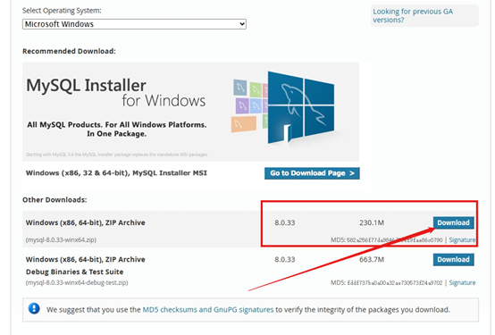
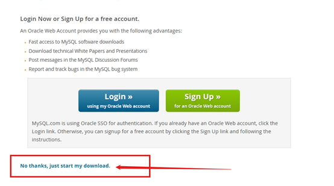
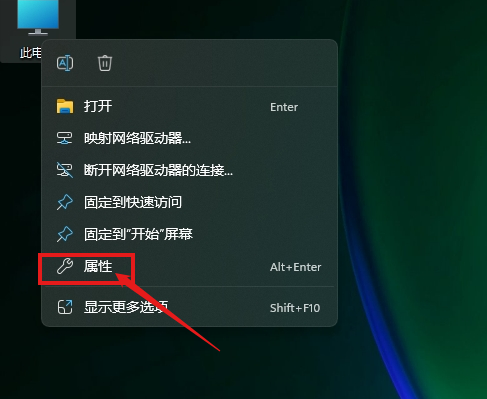
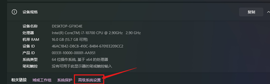
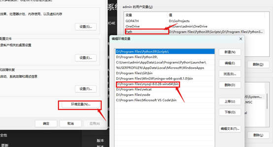
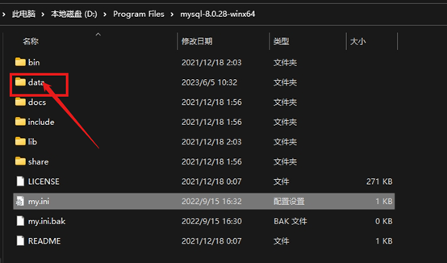
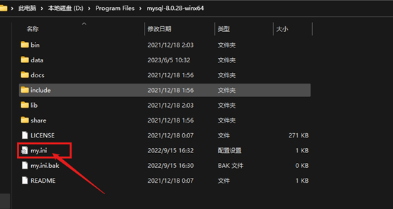
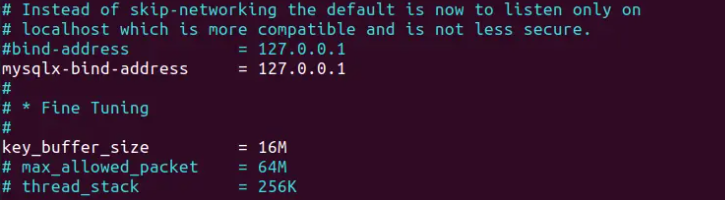

# mysql 数据库

## 一、安装数据库

### 1、mysql 数据库官网下载：[下载-https://dev.mysql.com/downloads/installer/](https://dev.mysql.com/downloads/installer/)





### 2、把下载的 mysql zip 包解压

### 3、解压的 zip 点击到 bin 路径下

### 4、复制 mysql 包的 bin 路径

### 5、配置系统环境变量(如下图所示)：





这是我安装的数据库，和上图下载的版本不是同一个版本，但操作一样。



### 6、创建 data 文件(如下图)：



### 7、配置 mysql 的 mysql.ini 文件(如果没有 mysql.ini 文件，直接创建就行，并填上一下的数据对应内容):



```
[mysqld]
#设置3306端口
port=3306
#设置mysql的安装目录 ----------是你的文件路径
#例如
basedir=D:\Program Files\mysql-8.0.28-winx64 # 修改成你的文件夹路径
#设置mysql数据库的数据的存放目录 ---------是你的文件路径data文件夹自行创建
datadir=D:\Program Files\mysql-8.0.28-winx64\data # 修改成你的文件夹路径
#允许最大连接数
max_connections=200
#允许连接失败的次数。
max_connect_errors=10
#服务端使用的字符集默认为utf8mb4
character-set-server=utf8mb4
#创建新表时将使用的默认存储引擎
default-storage-engine=INNODB
#默认使用“mysql_native_password”插件认证
#mysql_native_password
default_authentication_plugin=mysql_native_password
[mysql]
#设置mysql客户端默认字符集
default-character-set=utf8mb4
[client]
#设置mysql客户端连接服务端时默认使用的端口
port=3306
default-character-set=utf8mb4
```

### 8、初始化 mysql 数据库

```
mysqld --initialize --user=mysql --console # 回车

注意得到的数据中有你的初始密码。这个一定要记住，可先复制到文本中保存下来。
数据中密码出现的形式是：root@localhost:“密码”

然后执行：mysqld --install
然后开启mysql服务：net start mysql
```

### 9、然后就可以登录 mysql 数据库：

```
方式1：mysql -u root -p # 回车然后输入刚刚你保存文本的那个密码
方式2：mysql -u root -p你的密码
```

### 10、别忘了修改密码：

```
1、登录进数据库
2、set password='你的密码'
然后执行quit退出来，再执行第九步
```

### 11、mysql 开启远程访问权限

```sql
默认情况下，mysql只允许本地登录，即只能在安装MySQL环境所在的主机下访问。
1、打开终端进入mysql
>mysql -u 用户名 -p # 回车然后输入密码
2、查看数据库
mysql>show databases;
3、查看MySQL当前远程访问权限配置
mysql>use mysql;
mysql>select  User,authentication_string,Host from user;
4、开启远程访问权限
方式一：修改命令如下
mysql>update user set host='%' where user='用户名' #
方式二：授权法
通过GRANT命令可以授予主机远程访问权限
--赋予任何主机访问权限：
GRANT ALL PRIVILEGES ON *.* TO 'root'@'%' IDENTIFIED BY 'password' WITH GRANT OPTION;
--允许指定主机(IP地址)访问权限：
GRANT ALL PRIVILEGES ON *.* TO 'myuser'@'ip' IDENTIFIED BY 'root' WITH GRANT OPTION; # ip是指你允许该ip访问数据库，如：允许 192.168.100.3 的ip就把ip替换成 192.168.100.3

通过GRANT命令赋权后,需要通过FLUSH PRIVILEGES刷新权限表使修改生效：
flush privileges;

5、再次查看MySQL远程访问权限配置
select  User,authentication_string,Host from user;

注意:
出于安全性考虑，尤其是正式环境下
1.不推荐直接给root开启远程访问权限。
本案例仅以root用户作为例子做开启远程访问权限的配置,此为演示环境!

2.建议做权限细分和限制
正式环境中，推荐通过创建Mysql用户并给对应的用户赋权的形式来开放远程服务权限，并指定IP地址，赋权时根据用户需求，在GRANT命令中只开放slect、update等权限，做到权限粒度最小化。
```

## 二、数据库操作

### 1、创建数据库

```sql

```

### 2、创建数据库表

```sql

```

### 3、添加数据

```sql

```

### 4、删除数据

```sql

```

### 5、更新数据

```sql

```

### 6、查询数据

```sql

```


## Ubuntu安装MySQL

#### 1、ubuntu安装MySQL8.0.23

```shell
apt-get upgrade  # 更新软件包
apt-get install mysql-server # 安装MySQL
```

#### 2、启动mysql服务

```
启动：
    systemctl start mysqld
    或
    service mysqld start

查看启动状态：
	systemctl status mysqld
	或
	service mysqld status
```

**MySQL服务管理**

```plaintext
sudo service mysql status # 查看服务状态
sudo service mysql start # 启动服务
sudo service mysql stop # 停止服务
sudo service mysql restart # 重启服务
```

输入`service mysql status`就可以看到mysql正在运行中了，差不多要占350MB的内存

```awk
$ service mysql status
● mysql.service - MySQL Community Server
     Loaded: loaded (/lib/systemd/system/mysql.service; enabled; vendor preset: enabled)
     Active: active (running) since Wed 2021-02-10 16:15:50 CST; 17min ago
    Process: 1008 ExecStartPre=/usr/share/mysql/mysql-systemd-start pre (code=exited, status=0/SUCCESS)
   Main PID: 1168 (mysqld)
     Status: "Server is operational"
      Tasks: 37 (limit: 4620)
     Memory: 395.2M
     CGroup: /system.slice/mysql.service
             └─1168 /usr/sbin/mysqld

2月 10 16:15:45 ubuntu systemd[1]: Starting MySQL Community Server...
2月 10 16:15:50 ubuntu systemd[1]: Started MySQL Community Server.
```

#### 3、登录

**方法一：默认账户登录**

查看密码使用`sudo cat /etc/mysql/debian.cnf`这条查看

```
$ sudo cat /etc/mysql/debian.cnf
[sudo] bot 的密码： 
# Automatically generated for Debian scripts. DO NOT TOUCH!
[client]
host     = localhost
user     = debian-sys-maint
password = SffnwAJrKhIFZ2tO
socket   = /var/run/mysqld/mysqld.sock
[mysql_upgrade]
host     = localhost
user     = debian-sys-maint
password = SffnwAJrKhIFZ2tO
socket   = /var/run/mysqld/mysqld.sock
```

**方法二：直接进入mysql**
命令：`sudo mysql`

#### 本地 root 用户

到了关键的一步，其实现在你的数据库中就有一个叫做 `host` 字段为 `localhost` 的 `root` 的用户我们需要做如下几件事情：

- 修改初始 root 用户的密码（修为我们自己的密码）

> 不需要授予访问权限等操作，因为默认已经有了

**重置密码**

重置 root 账户密码

```pgsql
ALTER USER 'root'@'localhost' IDENTIFIED WITH mysql_native_password BY '新密码';
```

**刷新权限**

```abnf
FLUSH PRIVILEGES;
```

#### 远程root 用户

如果需要远程登陆：

- 创建一个 `host` 字段为 `%` 的 root 用户（创建用户的同时设置密码）
- 授权所有数据库的访问权限
- 刷新权限列表

> 有些 uu 就会很奇怪为什么要创建两个 `root` 用户呢？这个和 `mysql` 的用户管理方式有关系：`localhost` 表示本机登录；`%` 表示远程登陆。
> 如果 `root` 用户只有 `%` ，那就只能除了本机外的其他计算机才能登陆 mysql server，如果用户只有 `localhost`，那只有本机可以登录，远程计算机不能登录 mysql server
> 那么 mysql 为什么要这么设计呢？可能是为了安全吧！这样我们可以为 root 设置两个不同的密码，`localhost` 环境下设置一个很简单的密码；`%` 环境下就可以极其复杂，诸如：`MnRmsrdm9wjkT5XC9Y2F5b4IouAPZBfx` （注意 mysql 的密码有长度限制，好像是 32 个字符长度）

**新建一个 host 为 % 的 root用户，密码随意**

```sql
create user 'root'@'%' identified by 'yourpassword';
```

**授权**

```plaintext
GRANT ALL PRIVILEGES ON *.* TO 'root'@'%' WITH GRANT OPTION;
```

**刷新权限**

```abnf
FLUSH PRIVILEGES;
```

远程连接遇到如下错误：


先关停mysql服务

```arduino
sudo systemctl stop mysql
```

编辑mysql配置文件

```awk
sudo vim /etc/mysql/mysql.conf.d/mysqld.cnf
```



注销掉

```1c
#bind-address           = 127.0.0.1
```

在开启mysql服务即可`sudo service mysql start`
