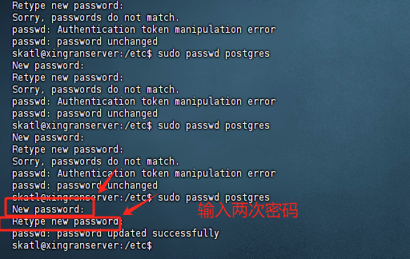
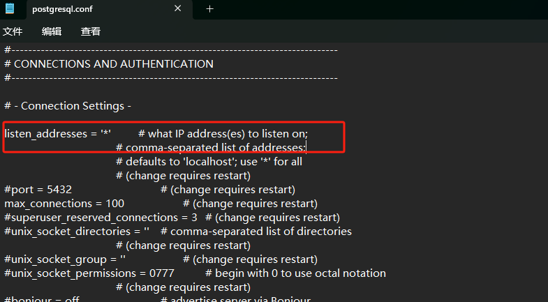
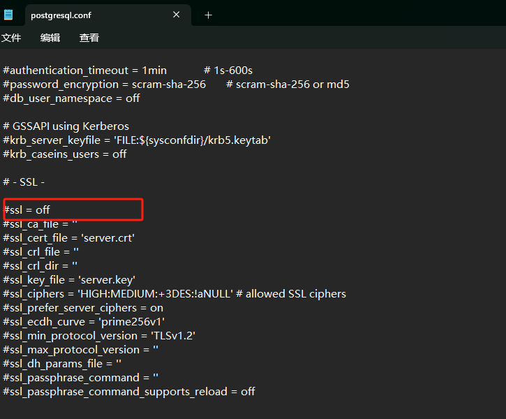

# postgres 数据库

### 一、Postgres 数据库安装

#### 1、[官网下载 postgres 包](https://www.postgresql.org/docs/release/)

#### 2、解压 postgres 软件包

#### 3、到解压的 postgres 文件夹目录下创建 data 文件夹

#### 4、打开 cmd 终端切换到解压的 posgres 文件夹目录下

#### 5、执行启动 postgres 服务

```
1、终端cmd切换到解压的postgres为bin目录下执行如下：
bin>pg_ctl.exe start -D 你上面创建data文件夹路径 # 例如：D:\\pgsql\data

2、终端cmd切换到解压的postgres为bin目录下执行如下:
bin>psql -U postgres  #以postgres用户登录psql
用户 postgres 的口令：输入你的密码
psql (14.0)
输入 "help" 来获取帮助信息.

postgres=#   #这一步就可以你要执行的操作了
```

# PGSQL 学习之数组字段

PGSQL 支技在字段中存储数组，定义时有三种方法：

1 字段名[],2 指定 ARRAY 关键字 3 直接输入维度， 如： NAME VARCHAR(20) [] 或 NAME VARCHAR(20) ARRAY,

建表：

```sql
--数组类型
create table lr_array1(
    id integer,
    array_i integer[], --数字类型数组
    array_t    text[]);   --text类型数组
```

插入数据

```sql
--数组类型的插入方式两种
--第一种
insert into test_array1(id, array_i, array_t) values(1 , '{1,2,3}', '{"abc","def"}');
--第二种
insert into test_array1(id, array_i, array_t) values(2 ,array[4,5,6,7],array['h','d','s']);
```

查询

```sql
select array_i from test_array1 where id = 1;--查询数组名即可
select array_i[1],array_t[1] from test_array1;--通过[]方式获取数据，下标从1开始
--查询array_i数据组中包含有3的 数据
```

```sql
--查询array_i数据组中包含有3的 数据
select * from lr_array1 WHERE array_i @>'{3}'

insert into lr_array1(id, array_i, array_t) values(1, '{1,2,3}', '{"abc","def"}');
insert into lr_array1(id, array_i, array_t) values(2, '{1,2,3}', '{"abc","def"}');
insert into lr_array1 values(5,'{3,2,1,0}','{"abc","cde","bef"}')
insert into lr_array1(id, array_i, array_t) values(3, array[4,5,6,7], array['h','d','s']);


-- SELECT created_at FROM zck_asset;
SELECT COUNT(*) FROM zck_asset WHERE created_at BETWEEN '2023-01-01' AND '2023-12-31';
```


## Ubuntu安装postgres

##### 1、执行更新命令

```
sudo apt-get update
```

##### 2、安装postgresql

```
sudo apt install postgresql
```

##### 3、登录postgresql命令

```
sudo -u postgres -i
```

##### 4、修改postgresql密码命令

```
sudo passwd postgres
```



##### 5、进入postgres用户

```
su - postgres
```

##### 6、进入postgresql

```
psql

psql --version # 查看版本号
```

##### 7、设置远程访问，并且关闭ssl

```
进入postgresql
查找postgresql配置文件位置
$ show config_file;
这里会显示postgresql.conf文件的位置路径
```

退出修改postgresql.conf文件内容





##### 8、修改postgresql的账号密码

```
psql进入数据库
postgres=#\password postgres
这里是你要输入的新密码
```

##### 9、修改允许访问网段，找到pg_hba.con配置文件，并进行内容修改，例如如下所示（具体修改根据你的IP段来修改）：

```
# IPv4 local connections:
host    all             all             127.0.0.1/32            md5
host    all             all             192.168.26.1/24            md5
host    all             all             192.168.25.15/24           md5
host    all             all             192.168.35.0/24           trust
# IPv6 local connections:
host    all             all             ::1/128                 md5
host    all             all             192.168.26.1/24            md5
```

